# ROS 2 Tutorial for Beginners (Part 1): Create Your First Workspace and Package

Interested in reading the blog form of this tutorial? 
[Click here](https://medium.com/@satyarthshree45/ros2-tutorial-for-beginners-part-1-creating-your-first-workspace-and-package-677f558e1f81)
## About This Article

This tutorial blog has been made for beginners who are just starting with ROS2 and are entirely unaware of its features and functionalities. Let’s dive in and explore what is ROS2 and how it works.

> Let's Start

First we will install ROS2. Before installing there is something which we should know. Let’s discuss that. To take the most out of this blog I suggest that you should use split screen feature if you are using a laptop or PC so that you can read this blog and follow along simultaneously. If you have a phone available with you right now then open this blog on your phone and use your laptop/PC to follow my instructions.

## ROS2 Distributions

First open this link: [https://docs.ros.org/en/foxy/Releases.html](https://docs.ros.org/en/foxy/Releases.html)  
After you scroll down you will find a list of distributions as shown:

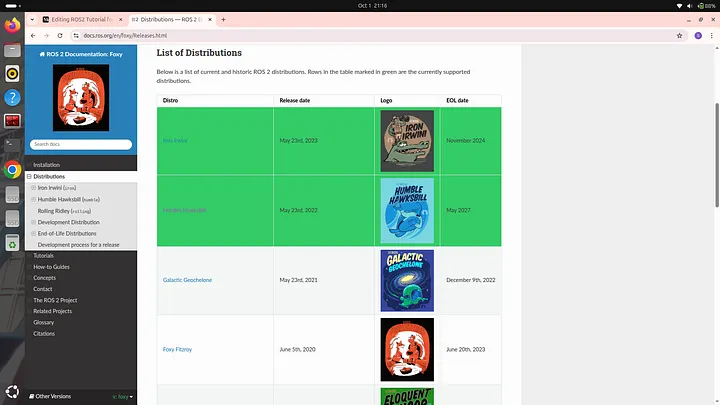

These are the several ROS 2 distributions which are currently available. Among these ROS 2 distributions some are highlighted green. Those are the distributions that are **currently supported** by the manufacturers of ROS 2. Some ROS 2 distributions are supported for a longer duration (5 years) of time while some are supported for a shorter duration. As you can see in the image above the release date of Iron Irwini distribution is May 23rd, 2024 and End of Life (EOL) date is November 2024. Which means this distribution is supported for 1.5 years meanwhile the distribution mentioned just below it which is Humble Hawksbill is supported for 5 years. It is always recommended to use ROS 2 distributions which are supported for a longer duration so that you can receive updates and keep your ROS 2 up to date for a longer duration. If you will scroll down then you will find a section titled “Future Distributions” as shown:

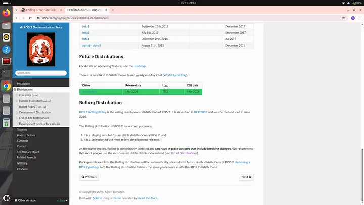

Under future distributions a distribution named **“Jazzy Jalisco”** is visible. As you can see it has been released in year 2024 and EOL year is 2029 which means it is the most latest ROS2 distribution and will be supported by manufacturer till 2029. In this tutorial we will be using this particular distribution as it is the most latest one and therefore learning this will prove to be more beneficial in future.

If you are reading this blog several years later after it was released then you will find more ROS2 distributions than the ones shown in the screenshots shared above. ROS2 Jazzy is the currently most latest version of ROS2 but in the future more versions will be released and then it won’t remain the latest one. If you are reading this blog after 2029 when the support for Jazzy distribution ends then I recommend that you should install the most latest version of that time. Even if you are using some another distribution then also I would recommend that you should read this blog because the core ROS2 functionalities will remain the same no matter what distribution you are using as these are the very basics of ROS2 and are least likely to change with time.
## Installing ROS2 Jazzy

Open your internet browser and search “ROS2 Jazzy Documentation”. The following search result will be displayed:

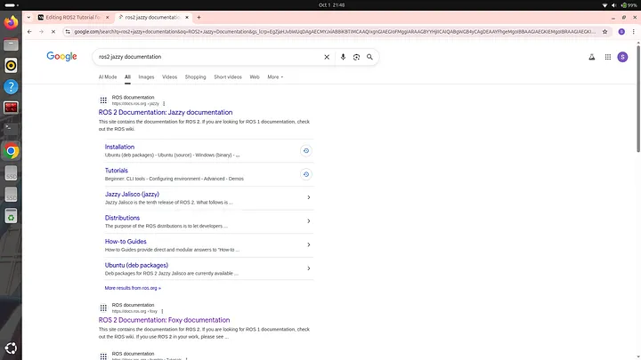

Click on the first link which is shown in the search results. The following interface will be displayed:

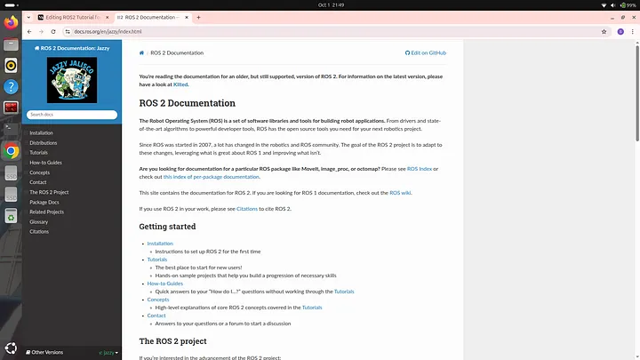

Then click on “Installation”. Now the following interface will be displayed:

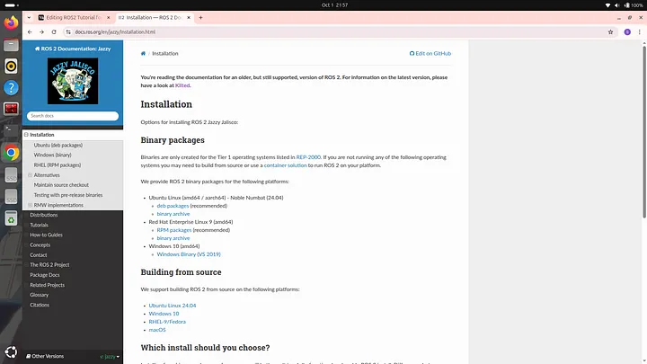

Here you will see different links of installation for different operating systems. My suggestion would be that you should for for Ubuntu Linux as it offers the best support, stability and documentation for ROS2 development. When I was starting with ROS2 I had windows 11 only so I dual booted my windows 11 with **Ubuntu Linux 24.04** to run and practice ROS2.  
It is **very important** to note that you should have **Ubuntu 24.04** as only this version of Ubuntu is compatible with ROS2 Jazzy distribution. If you also have windows 11 operating system and want to dual boot Ubuntu 24.04 then I would recommend you to watch the following youtube video: [https://youtu.be/alFosqQ1ang?si=CW5WHmHIIRPMOggH](https://youtu.be/alFosqQ1ang?si=CW5WHmHIIRPMOggH)

I also followed this video to successfully boot my windows 11 with Ubuntu. If you have some other operating system then I would recommend you to search for a reliable youtube video tutorial which teaches how to dual boot Ubuntu 24.04.

> Continue reading after you have dual booted Ubuntu 24.04

Alright so under heading Installation you can see a sub heading “Ubuntu Linux” under which deb packages is written. Click on “deb packages”. Following interface will open:

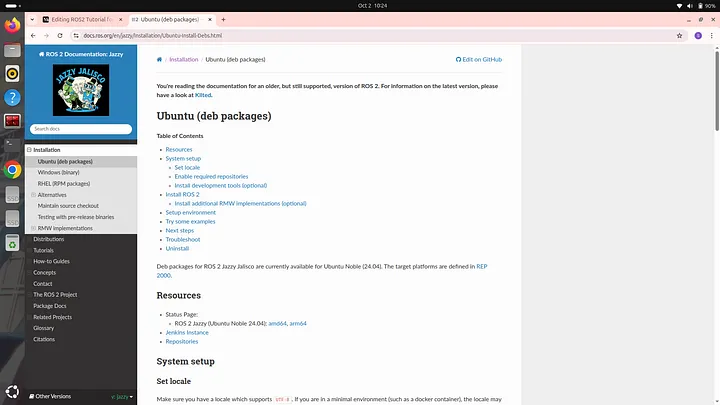

Scroll down and you will find a set of commands as shown:

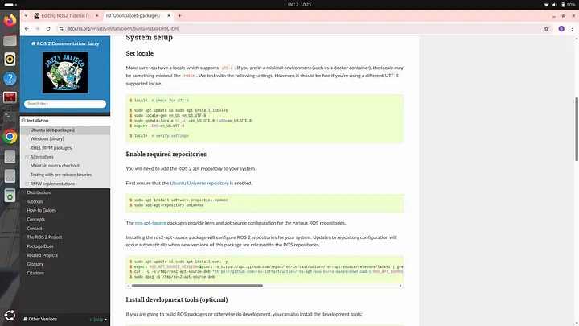

Now you have to open your terminal and copy paste these commands one by one on your terminal from beginning to end. After doing that you ROS2 jazzy distribution will be successfully installed.  
You will also find a command to Install development tools as shown:

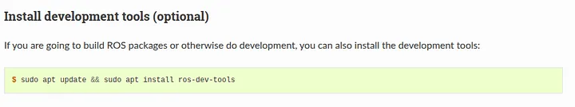

Although installing development tools are option but I would highly recommend you to install them also.  
At the end you will find commands to install ROS2 in two different ways as shown here:

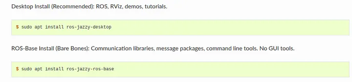

One way is the “Desktop Install” and the other one is the “Base Install”. We will go with the desktop installation method as then we will be able to access tools required for simulation. So to go with this method just copy paste the command written under Desktop Install heading to your terminal. If you go for base installation then you won’t be able to experience simulation later on. After you have executed all the commands successfully without any error then we need to check whether ROS2 has been successfully installed or not. To check whether ROS2 has been successfully installed or not we need to setup the environment for ROS2. To do so type the following command on your terminal:

```bash
source /opt/ros/jazzy/setup.bash
```

and then type:

```bash
ros2
```

If something like this is being displayed:

```
usage: ros2 [-h] [--use-python-default-buffering]  
            Call `ros2 <command> -h` for more detailed usage. ...  
  
ros2 is an extensible command-line tool for ROS 2.  
  
options:  
  -h, --help            show this help message and exit  
  --use-python-default-buffering  
                        Do not force line buffering in stdout and instead use  
                        the python default buffering, which might be affected  
                        by PYTHONUNBUFFERED/-u and depends on whatever stdout  
                        is interactive or not  
  
Commands:  
  action     Various action related sub-commands  
  bag        Various rosbag related sub-commands  
  component  Various component related sub-commands  
  daemon     Various daemon related sub-commands  
  doctor     Check ROS setup and other potential issues  
  interface  Show information about ROS interfaces  
  launch     Run a launch file  
  lifecycle  Various lifecycle related sub-commands  
  multicast  Various multicast related sub-commands  
  node       Various node related sub-commands  
  param      Various param related sub-commands  
  pkg        Various package related sub-commands  
  run        Run a package specific executable  
  security   Various security related sub-commands  
  service    Various service related sub-commands  
  topic      Various topic related sub-commands  
  wtf        Use `wtf` as alias to `doctor`  
  
  Call `ros2 <command> -h` for more detailed usage.
```

then that means that your ROS2 has been successfully installed. If it is not successfully installed then a message stating **ros2 command not found** will be displayed.  
We used the following command to setup the environment of ROS 2:

```bash
source /opt/ros/jazzy/setup.bash
```

Here instead of jazzy you should write the name of the distribution that you are using. If you are using Humble distribution then write “humble” instead of “jazzy”. We will be using two tools in this tutorial which you also need to install. The first tool is VS Code and the second tool is a text editor named gedit. You will understand later why we are using these tools. To install VS Code type the following command on your terminal:

```bash
sudo snap install code --classic
```

It might ask your permission to install some files and then VS Code will be installed. After it is installed we will install gedit. To do so type the following command on your terminal:

```bash
sudo apt install gedit
```

Again some files will be installed. After it is installed you can check by typing command:

```bash
gedit
```

A text editor will open as shown:

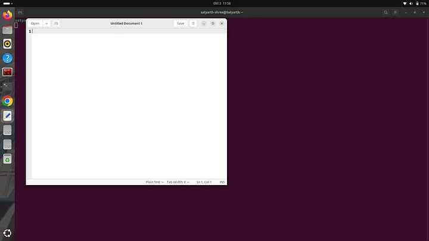

This means that gedit is successfully installed. Now close this text editor interface and continue with blog.

---

## Understanding Some Basic Commands of Terminal

> If you already have an understanding of basic Linux terminal commands like cd, ls and mkdir then you can skip this particular section.

Now close the terminal on which you were working right now and the again open a new one. Before starting to learn ROS2 we should know some basic commands which are used in a linux terminal. Before we learn these basic commands click on the bottom left icon on your linux operating system to open the interface from where you can view different apps installed on your system. Then search for files in the search bar. You will see icon of files app. Right click on it and select “Pin to Dash” so that you can easily access it from the side bar present on the left side of the screen.

Now we will explore some basic commands that can be used in a terminal.

### Creating a Folder and the Concept of Current Working Directory

First we will learn how to create a folder using a terminal and then we will try to understand what is the concept of a **current working directory** and what exactly is current working directory.

> Let’s go

We will create a folder named “my_first_folder”. To do so open a terminal and type:

```bash
mkdir my_first_folder
```

mkdir is a command which is used to **create a folder** on our system. After typing this command open files app which you have pinned to dash by clicking on it’s icon available in the side bar. Following interface will appear before you:

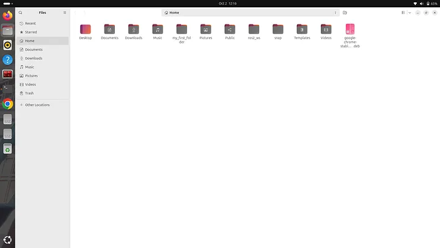

As you can see a folder named “my_first_folder” has been created. This means our command worked successfully and the folder we desired has been created.  
It is important to note that whenever you create a folder refrain from using empty spaces. If you want to separate different words you can use an underscore like we did when we created the folder named “my_first_folder”. Alright now close the files app.  
We will now try to understand what is a directory and what are the various levels of directory based on their level of organisation.

A directory is nothing but a folder which has some other sub folders or files inside it. We have just created a folder named “my_first_folder”. This folder can be also called as an empty directory as it doesn’t contains any files or folder inside it, because we have just created it and haven’t added anything inside it. Terms like Folder and Directory are often used interchangeably in computing to describe a container used for storing and organizing files and other folders. Alright so we have created a folder or you can say a directory. But do you know where this directory has been created? It is created in the root directory which is the highest level of directory of a hierarchical file system. All other files and folders of a system exists inside the root directory. In a file hierarchy system the root directory is at the topmost level and is often referred as the directory in which all the other files and directories exists. If we again create a new folder then it will again be created in the root directory but let’s say we want to create another directory inside the “my_first_folder” directory which we have already created then how will we do? To understand this we must first understand the concept of working directory. The working directory is referred to as that directory which is currently active and we are making some changes in it using terminal. By default whenever we open terminal and create a folder then it always gets created in the root directory because the root directory is the working or we can say currently active directory. If we want to create a folder inside some other folder then we have to simply change the directory that is currently active to that folder. We will understand this by an example. Let’s try creating a folder named “folder_1” inside the folder that we have already created which is “my_first_folder”. To do so open your terminal. If you use mkdir command now then the new folder will be created in the root directory which we do not want. So first we will change our working directory. To do so we will type the following command:

```bash
cd my_first_folder/
```

Here cd means change directory. We will write the name of the directory inside which we want to create a new directory and then write forward slash at the end. After you type this statement then you will see that the name “my_first_folder” will be highlighted in blue colour just below this line as shown:

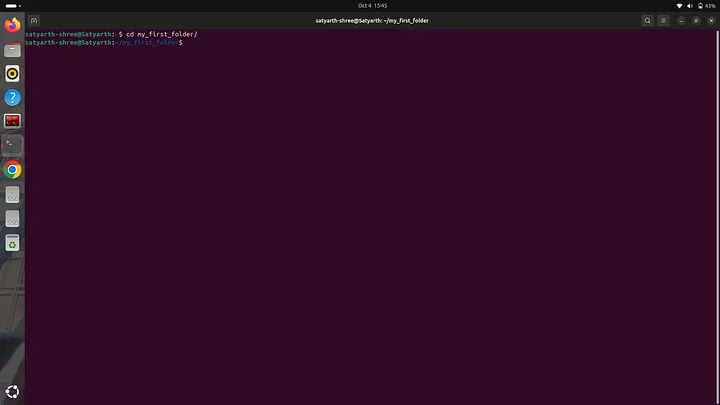

Now when our working directory is my_first_folder we can use mkdir command to create the folder that we desired. Now execute the following command:

```bash
mkdir folder_1
```

After running this command open the files app and click on the my_first_folder to see the files and folders inside it. You will find a folder named “folder_1” there as shown:

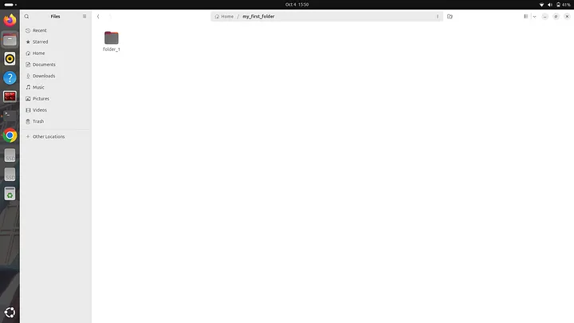

Now let’s assume I want to create another folder named “my_second_folder” in the root directory, not inside my_first_folder then how will I do it? Currently we are inside the my_first_folder so if we use the mkdir command then the folder “my_second_folder” will be created inside the my_first_folder which we do not want. So now we have to go one level back to again return back to root directory. To do type the following command:

```bash
cd ..
```

Once you type this command and press enter then the name “my_first_folder” which was highlighted in blue color will disappear as shown:


This means that now we have moved back to our root directory and now we can create our desired folder using the mkdir command as shown:

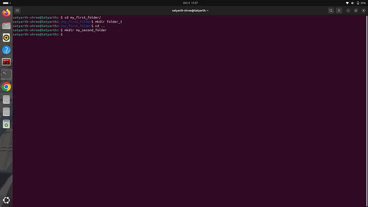

Now open files app and you will see a folder named “my_second_folder” as shown:

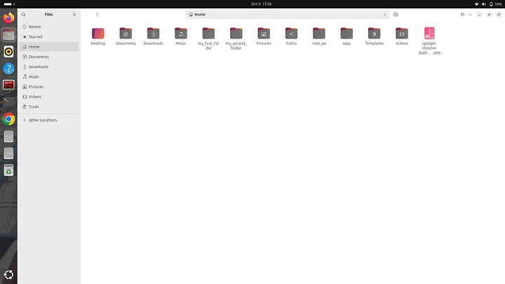

If you are getting confused on how different levels of files are segregated then you can simply try to visualize them using the following structure:

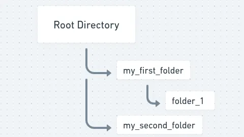

We have created two folders within root directory named “my_first_folder” and “my_second_folder”. We have also created a folder named “folder_1” inside “my_first_folder”. Here we can say that my_first_folder and my_second_folder have the same level of organization because they directly come under the root directory. In simpler words we can say that the folders my_first_folder and my_second_folder exist in the root directory and the folder named folder_1 also exists within the root directory but it isn’t directly under the root directly because it is inside my_first_folder as shown in the above structure.

### Viewing Files and Folders inside a Folder Using Terminal

We already know how to view files and folders using the Files app. But to view it using terminal type the command “ls” as shown:

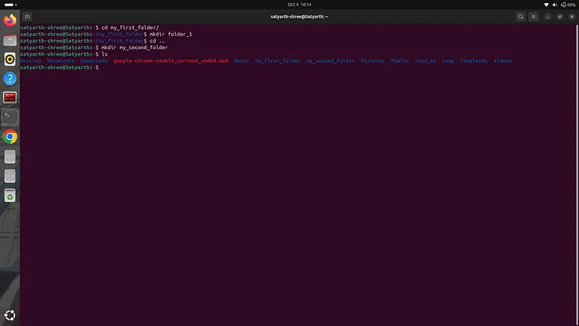

The command “ls” will lists all the files of the working directory. We are currently in the root directory which means our working directory is the root directory so when we used the command “ls” then all files and folders inside root directory was displayed including my_first_folder and my_second_folder as you can see in the figure shared above. If we want to check what files and folders exist in a specific folder say for example my_first_folder then we will use the command “cd” to change directory and then we will use the command “ls” to view files as shown:

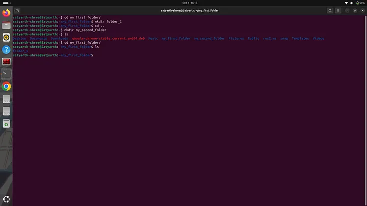

As you can see when we used “ls” folder_1 was displayed because that is the only folder which exits inside the folder my_first_folder. If we want to now view the files and folders which exist inside my_second_folder then we will use the command “cd ..” to move back to the root directory, then we will use command “cd my_second_folder/” to make this folder our current working directory and then will use command “ls” to view files and folders inside it. 
Let’s do it

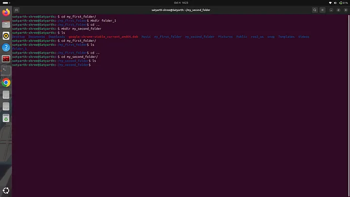

As you can see in the figure given above that when I used command “ls” then nothing was displayed this is because we haven’t created any file or folder inside my_second_folder.

> I explained some basic commands of Linux terminal and also some basics of file organisation in a computer system so that you can easily understand ROS2 as these basics are used everywhere and are a must to know. If you understood these commands and how they work then we can finally start learning ROS2. If you didn’t understood something then feel free to drop a comment. I will reply as soon as possible from my side.

---

## Creating a Workspace and a Package using ROS2

Before continuing close the current terminal and open a new one.

### Setting up environment for ROS2

Before you can use ROS2 you have to setup an environment for it otherwise it will not work even if you have installed it. To setup environment for ROS2 Jazzy distribution type the following command on your terminal and press enter:

```bash
source /opt/ros/jazzy/setup.bash
```

If you are using ROS2 Humble distribution then type “humble” instead of “jazzy” in the above mentioned command.
Whenever you open a new terminal you have to always type this command before using ROS2. This task can be very annoying. To avoid it we will use the text editor that we downloaded earlier in this blog. Type the following command on your terminal:

```bash
gedit .bashrc
```

The following interface will open:


.bashrc is actually a text file which has various commands written and saved in it. The commands saved in it are automatically executed whenever we open a new terminal so if we add the command to setup our ROS2 environment in this file and then save the file then we don’t need to run the command to setup ROS2 environment again and again because whenever we open a terminal it will be executed automatically.  
At the end enter the command to setup ROS 2 environment as shown:

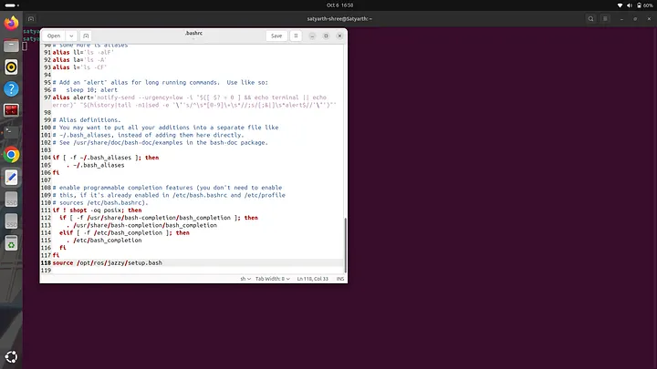

Now press save written near the top right corner of the text editor and wait for few seconds. After few seconds are over close the text editor and also close the terminal on which you are currently working. Now open a new terminal and type:

```bash
ros2
```

Press enter. Following text will be displayed:

```
usage: ros2 [-h] [--use-python-default-buffering] Call `ros2 <command> -h` for more detailed usage. ...  
  
ros2 is an extensible command-line tool for ROS 2.  
  
options:  
-h, --help show this help message and exit  
--use-python-default-buffering  
Do not force line buffering in stdout and instead use the python default buffering, which might be affected by PYTHONUNBUFFERED/-u and depends on whatever  
stdout is interactive or not  
  
Commands:  
action Various action related sub-commands  
bag Various rosbag related sub-commands  
component Various component related sub-commands  
daemon Various daemon related sub-commands  
doctor Check ROS setup and other potential issues  
interface Show information about ROS interfaces  
launch Run a launch file  
lifecycle Various lifecycle related sub-commands  
multicast Various multicast related sub-commands  
node Various node related sub-commands  
param Various param related sub-commands  
pkg Various package related sub-commands  
run Run a package specific executable  
security Various security related sub-commands  
service Various service related sub-commands  
topic Various topic related sub-commands  
wtf Use `wtf` as alias to `doctor`  
  
Call `ros2 <command> -h` for more detailed usage.
```

This means that the environment for ROS2 is successfully setup even when we do not typed the command to setup ROS2 environment in the new terminal that we just opened. This is because we already added command to setup ROS2 environment in .bashrc file so now it will be executed automatically whenever we open a new terminal.

### Creating a Workspace in ROS2

Before creating your first workspace run the following commands in the given sequence.

First run:

```bash
sudo apt update
```

and then run:

```bash
sudo apt install python3-colcon-common-extensions
```

A ROS2 workspace is basically a directory in which various packages and nodes are organised. So to create a ROS2 workspace we have to create a folder. We will create a workspace named “ws_1”. To do so we have to type and run the following command:

```bash
mkdir ws_1
```

Now we have to create a source folder in our python workspace. The source file should be named “src”. All our nodes and packages will go inside this folder. To do so first run the following command:

```bash
cd ws_1
```

and then run:

```bash
mkdir src
```

Now to check whether src folder has been created or not run the “ls” command and you will see the name of src folder being displayed as shown:

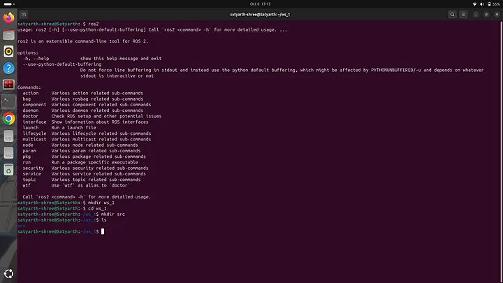

Now run the following command:

```bash
colcon build
```

You will see the following message will be displayed:

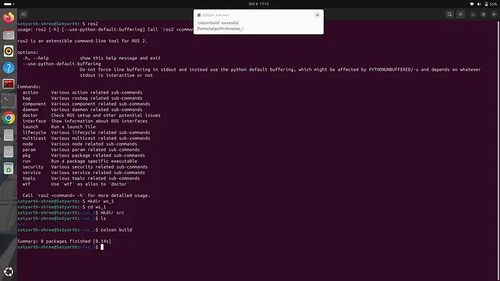

This means the build is successful. Now use the “ls” command to view files inside our workspace and you will notice that 3 more folders are been created apart from src as shown:

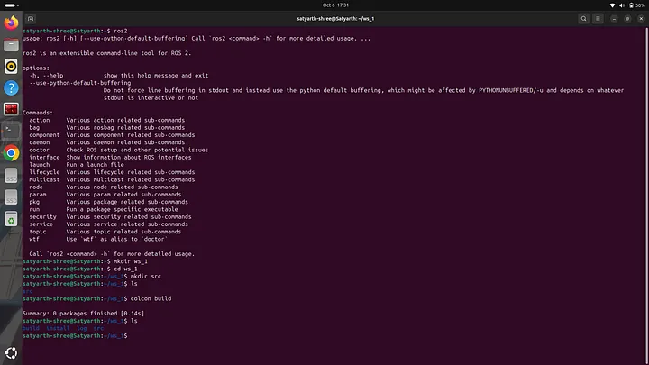

The name of these three folders are build, install and log. If we want to use the custom nodes that we will create then we have to run the following command:

```bash
source ~/ws_1/install/setup.bash
```

We will have to run this command every time we open a new terminal if we want to use nodes that we have created. This task can be irritating. So to avoid this we will type this command in .bashrc file just as we did with the command used for setting up environment for ROS2. Type the following command to move out of workspace:

```bash
cd ..
```

and then type the following command:

```bash
gedit .bashrc
```

At the end write the command:

```bash
source ~/ws_1/install/setup.bash
```

and then save and exit the file.

Now you won’t have to type this command again and again when you are working with this workspace.

### Creating a Package in ROS2

After creating a workspace now we will learn how to create a package. To do so we will first change our working directory to source folder which is inside our workspace because packages are created inside source folder only. We will first type and enter the following command to change the working directory to our source folder:

```bash
cd ws_1/src/
```

If you are already inside the workspace then use the following command:

```bash
cd src/
```

If you use “ls” now then nothing will be displayed because the source folder is currently empty as shown:

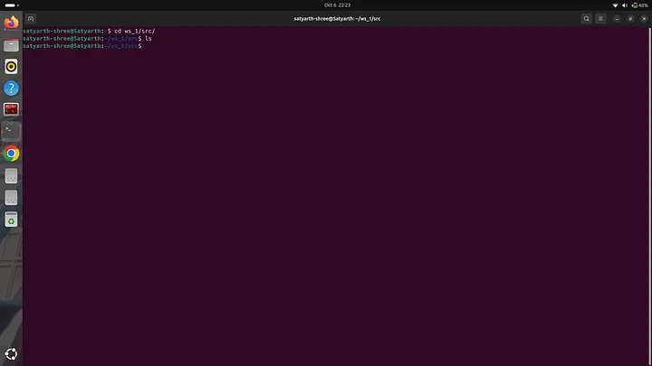

Before creating a package first we need to understand the two types of packages that can be created in a workspace. They are **python package** and **C++ package**. In this tutorial we will be discussing how to create a python package. I will create a python package named “my_first_package”. To do so we have to use the following command:

```bash
ros2 pkg create my_first_package --build-type ament_python --dependencies rclpy
```

We will write the name of the package after word “create”. In this command rclpy represents python library for ROS2. If you wish to create a C++ package instead of a python package then run the following command:

```bash
ros2 pkg create my_first_package --build-type ament_cmake --dependencies rclcpp
```

In this tutorial I will be creating a python package so to do so we will run the first command as shown:

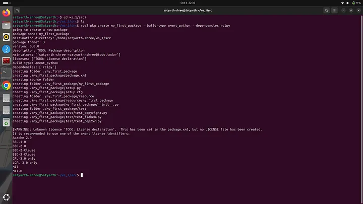

A set of messages as shown will be displayed when we run a command to create a package. Now if you the “ls” command you can see the name of the package as shown in the figure below:

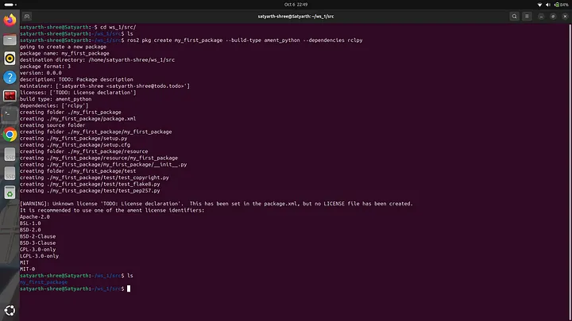

But the package hasn’t been completely created yet. We have to now build the package. To do so we have to first move to our main workspace folder from src folder. Type the following command to do so:

```bash
cd ..
```

Now type the following command and press enter:

```bash
colcon build
```

Following message will be displayed:

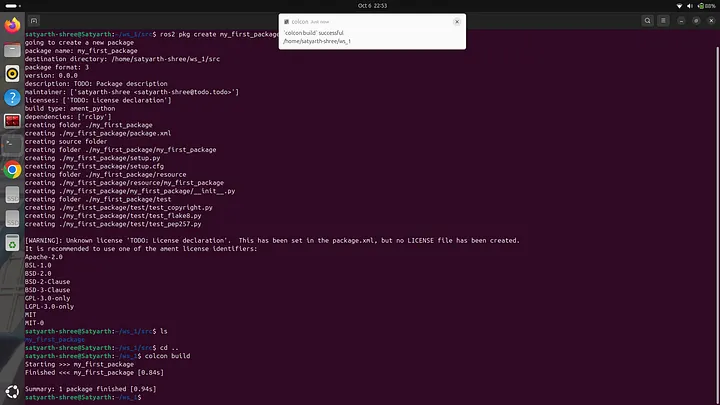

As you can see at last the following message is being displayed:

> **Summary: 1 package finished [0.94s]**

This means the build is successful. Now you will automatically find another folder inside the package which has the same name of the package. To do verify change your current directory to your package and then use the “ls” command as shown in the image below:


As you can see inside package some files and folders have been created even though we didn’t create them. This is a way to check that package has been successfully created.

This was all for today’s blog. It took a great deal of time and effort to write this blog. I hope you understood what we discussed today. If you have any queries you can ask me in the comments section. I will try to reply as soon as possible.

**Next in this series:**

[ROS 2 Tutorial for Beginners (Part 2): Create Your First Node](https://medium.com/@satyarthshree45/ros-2-tutorial-for-beginners-part-2-creating-your-first-node-c33e92d54b5c)

Part 2 will help you in creating your first node which is the next step after you have succeeded in creating a package.

# About The Publication

This blog has been produced under a publication named **ROS Simplified**.
_ROS Simplified_ is a learner-driven publication dedicated to making ROS (Robot Operating System) concepts clear, practical, and accessible. We provide tutorials, conceptual explainers, and project walkthroughs designed to help students, hobbyists, and engineers understand and apply ROS efficiently.

[Click here to view the offcial page of ROS Simplified publication ](https://rossimplified.substack.com/)

# About The Author

Hi, I am Satyarth Shree a first semester BTech Robotics and Automation student at Lovely Professional University (LPU), India. I am an aspiring robotics engineer who is publicly documenting his learning journey using platforms like medium and wordpress. My areas of interests include ROS, python and mathematics. Currently I am focusing on ROS more. I have also started a publication named ROS Simplified to make ROS accessible to everyone by providing beginner friendly tutorials free of cost.

# Let's Connect

**My Github**: [https://github.com/Satyarth-Shree](https://github.com/Satyarth-Shree)  
**My LinkedIn:** [https://www.linkedin.com/in/satyarth-shree-761357374/](https://www.linkedin.com/in/satyarth-shree-761357374/)  
**My CodeWars:** [https://www.codewars.com/users/Satyarth-Shree](https://www.codewars.com/users/Satyarth-Shree)  
**My X:** [https://x.com/BuildUnderdog](https://x.com/BuildUnderdog)  
**My Hashnode:** [https://hashnode.com/@SatyarthShree](https://hashnode.com/@SatyarthShree)  
**My Portfolio:** [https://satyarth-shree.github.io/My-Portfolio/](https://satyarth-shree.github.io/My-Portfolio/)  
**To professionally contact me for internships, collaborations or similar opportunities click here:** [https://forms.gle/SH9bj1oJwqPtJtD26](https://forms.gle/SH9bj1oJwqPtJtD26)_


