# ROS 2 Tutorial for Beginners (Part 2): Creating Your First Node

This tutorial is written for beginners who wish to understand what a node is and how they can create a ROS 2 node.

If you are such a person then you are most welcomed to continue reading this article.

## What are Nodes?

The first question that arises in our mind is — what is a node? Instead of memorizing definitions I will show you exactly what is a node and how you can create one. Before creating a node it is important to know how to create a workspace and a package. Without creating a ROS 2 workspace and package you cannot create a ROS 2 node.

If you know how to create a package then you can continue reading this blog. But if you don’t know how to do so then you won’t understand what we will be discussing.

You can refer to the following article to learn how to create a workspace and a package:

[ROS 2 Tutorial for Beginners (Part 1): Creating Your First Workspace and Package](part-1-create-your-first-workspace-and-package)

This article mentioned above is the part 1 of this ROS 2 beginner series.

> Note: It is very important to understand how to create a workspace and a package before you learn how to create a node. So only proceed if you know these pre requisites.

## Creating a Workspace and a Package

The two most popular programming languages that are used with ROS 2 is C++ and python. So most of the nodes that you will deal with will be either python nodes or C++ nodes. A node created using python is referred to as a python node and a node created using C++ programming language is called a C++ node.

In this tutorial I will teach how you can create a python node. As a beginner let’s try to create a python node first as python is a high level user friendly programming language when compared to C++ so it will be easier for you to understand.

Before creating a python node first you need to create a workspace and then you need to create a python package inside it. Let’s create a workspace named “ws” and a package named “py_pkg” inside it.

First you need to source ROS 2 by running the following command on your terminal:

```bash
source /opt/ros/distro/setup.bash
```

In place of distro you have to write your ROS 2 distribution name which you are currently using. For example: If you are using ROS 2 humble then you have to write humble instead of distro. If you are using ROS 2 Jazzy then you need to write jazzy in place of distro.

After running this command we will first create a folder named ws as shown below:

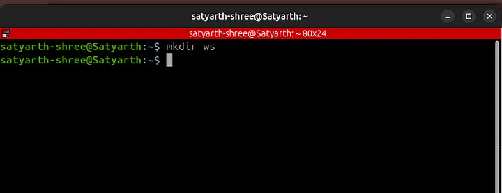

Now we have to create a source folder inside this folder which is our workspace. To do so we will first move inside this folder using change directory (cd) command and then we will create source folder as shown:

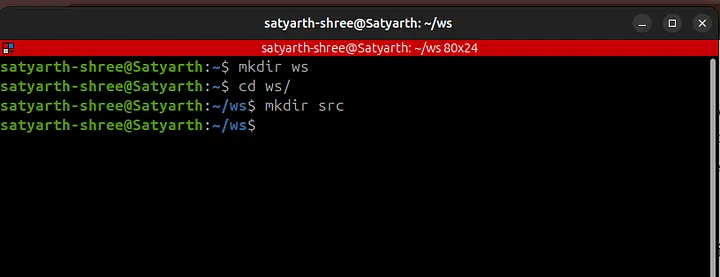

Now we will build by workspace by running the command colcon build as shown below:

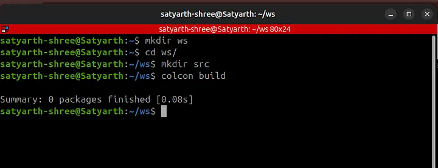

Now to create a python package we will type the following command:

```bash
ros2 pkg create py_pkg --build-type ament_python --dependencies rclpy
```

Now we will again run the command: colcon build to build our workspace as shown in the figure below:

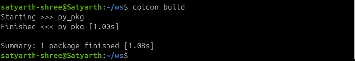

As you can see the following message is being displayed:

```
Summary: 1 package finished [1.08s]
```

This means our package has now been successfully build.

Be careful about few things while executing commands. The command: colcon build must be executed from workspace and not from any other folder. The command to create package must be executed when you are inside the source folder. These things have already been discussed in part 1 of this blog series.

Inside src folder we have a folder named py_pkg. Navigate inside the src folder using the cd command and then use the ls command to see the package as shown in the figure given below:

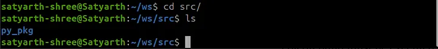

Inside the package named “py_pkg” there is another folder having the same name. Use the cd command to move inside this folder by typing the following command while you are inside you src folder:

```bash
cd py_pkg/py_pkg/
```

These things have been already discussed in my previous blog. The things I am going to discuss next are new so pay attention.

## Creating a Node

Now to create a python node we first need to create a python file. To create a python file we will use the following command:

```bash
touch my_first_node.py
```

After touch we have to write the name of our python file along with extension of a python file. By writing the command given above we have created a python file named “my_first_node”.

Now we have to make this file python file an executable so that you can later use the node which you will create inside this file. To make this file an executable we will execute the following command:

```bash
chmod +x my_first_node.py
```

These commands have to be executed when you are inside the folder py_pkg which is inside your package named py_pkg which is inside src folder.

The current structure of your workspace is as follows:

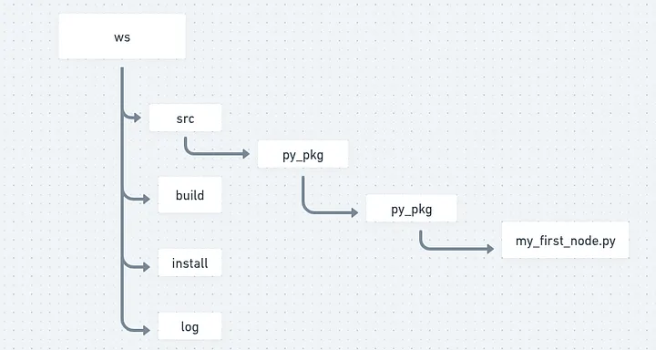

As shown in the figure given above inside your package named “py_pkg” there exists a folder with the same name and inside that folder my_first_node.py exists. You should be now inside the folder in which you have created your node. After making your python file an executable run the command: ls and you will see the following output:

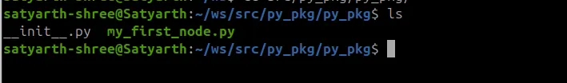

As you can see my_first_node.py is written in green color. When a file is written in green color then that means that file has now become an executable file. If file name is showing up in blue color in your system then maybe you have made some mistake while executing the command to convert file into an executable.

There are two things that should be kept in mind if your file has not became an executable.

Either you have made some syntax error while typing the command or you have executed the command in some other directory where your file didn’t existed.

So first type the following command:

```bash
cd ~/ws/src/py_pkg/py_pkg/
```

This command will make sure that you are now inside the py_pkg folder inside your package where you need to make your file an executable. Now run this exact command:

```bash
chmod +x my_first_node.py
```

This will make your python file an executable. But before making an executable you need to make sure that your python file actually exists in the py_pkg folder inside your package. To check whether it exists or not use the ls command like I have told you earlier.

Now after you have created an executable python file go back to your workspace in terminal and execute the following command from the workspace folder:

```bash
code .
```

This will open VS Code. If you are confused how this happened I recommend you to read [part 1 of this series](https://medium.com/@satyarthshree45/ros2-tutorial-for-beginners-part-1-creating-your-first-workspace-and-package-677f558e1f81). After opening vs code you can now start programming your first node.

Go to your python file and now let’s start programming it on vs code.

Things might be feeling a little bit heavy especially if you are a beginner and you are not very much comfortable with Linux terminal commands. So I recommend pausing for a moment and revising what you have done till now before continuing further.

ROS will drain your mental energy very quickly if you try to memorize things and try to move forward quickly. But if you try to understand things instead of just memorizing them then you will find it very enjoyable.

After you are comfortable with what we have discussed till now you are welcomed to continue reading this article.

We will create a python node which displays a message on screen. Let’s start creating it.

## Writing Code of Node

At the top of your python file you should write:

```python
#!/usr/bin/env python3
```

This line is known as **shebang**. This line tells the interpreter that “You should use python3 interpreter to execute this python file.”

It needs to be added at the very top of your python file as shown below:

```python
#!/usr/bin/env python3
```

Now to use functionalities of ROS 2 we need to import python library for ROS 2 which is rclpy. So now we will write:

```python
import rclpy
```

rclpy is basically a library. You need to have a basic idea of what a python library is and how it is internally structured or made before we continue creating our node.

### Structure of a Python Library

A python library is nothing but a folder that has some python files inside it. In the similar manner rclpy is nothing just a folder which has some python files inside it.

One of the files inside this folder rclpy is node.py. This file has some important functions and classes which are required to create a node. We need to use these functionalities if we want to create a node.

Basically rclpy has a file inside it named node.py and inside this file there is a class named Node. We have to use this class if we want to create a node which displays a message on our screen.

---

To use this class we will now write the following line in our python file:

```python
from rclpy.node import Node
```

This command is used to import the Node class from the file node.py which is inside the library rclpy.

Currently we have written this much code:

```python
#!/usr/bin/env python3
import rclpy
from rclpy.node import Node
```

I have also explained why we have written each one of them.

Now we will write our main code to display a inside a function called main().

But why?

You will understand why we are doing so later in this blog. First create a function named main() as shown in the code snippet given below:

```python
#!/usr/bin/env python3
import rclpy
from rclpy.node import Node

def main():
```

Alright till now we have imported rclpy, imported a class named Node from rclpy and created a function named main().

But can we use the functionalities of ROS 2? The answer is no.

Node is one of the functionalities of ROS 2. If we wish to create a node then we must first get access to ROS 2 functionalities. To do so we will type the following line:

```python
rclpy.init()
```

This line basically starts the ROS 2 engine. After this line gets executed you can now basically start using ROS 2 functionalities. You should type this line inside the main() function as I earlier told you that the main code to display messages need to go inside the main() function as shown in the code snippet below:

```python
#!/usr/bin/env python3
import rclpy
from rclpy.node import Node

def main():
	rclpy.init()
```

Think of ROS 2 as a car which is parked inside a garage. When you wrote the line:

```python
import rclpy
```

You have basically opened the gate of the garage. You can see the car but you haven’t yet turned it on. In the similar way you can use ROS 2 functionalities but you haven’t yet enabled them.

When you type:

```python
rclpy.init()
```

Now you have started the engine of the car and now you can access it’s functionalities. So now your ROS 2 has started working in the background.

This is what is happening here.

Now you have to create a node. Creating a node involves giving your node a name. Let’s create a node named “python_node”. To do so we will type the following line below rclpy.init():

```python
node = Node("python_node")
```

This line will be written as shown in the code snippet given below:

```python
#!/usr/bin/env python3
import rclpy
from rclpy.node import Node

def main():
	rclpy.init()
	node = Node("python_node")
```

We have basically passed the name of our node as an argument to the Node class that we earlier imported. We imported the Node class because it is required to create a node. We have used the variable node while calling the class Node. You can use some other variable also. There is no restriction on the variable that you want to use here. But make sure that the name of your node is correctly passed to the Node class.

Now to print a message you need to write the following command:

```python
node.get_logger().info("I am learning ROS 2.")
```

It will be written just below the line in which we have initialized our node as shown in the code block below:

```python
#!/usr/bin/env python3
import rclpy
from rclpy.node import Node

def main():
	rclpy.init()
	node = Node("python_node")
	node.get_logger().info("I am learning ROS 2.")
```

Whatever message you want to display must be written in parenthesis of info() function between inverted commas like I have written “I am learning ROS 2.”

Do you remember I earlier told you that typing rclpy.init() means enabling ROS 2 functionalities or you can also say that starting the ROS 2 engine. We have started the engine and now we have also written the code to display our message. It’s time to close the engine because now we no longer need it as our purpose is accomplished — a node that displays a message has been created.

To again disable ROS2 functionalities write the rclpy.shutdown() at the end as shown in the code block given below:

```python
#!/usr/bin/env python3
import rclpy
from rclpy.node import Node

def main():
	rclpy.init()
	node = Node("python_node")
	node.get_logger().info("I am learning ROS 2.")
	rclpy.shutdown()
```

Press Ctrl + S to save this code. 

You have successfully written your code but can you use this node now? The answer is no!

---
## Creating an Executable

In ROS 2 just finishing the code doesn’t mean your node is now usable. You have to create an executable to use your node. Before creating an executable you should decide a name for your executable. Let’s create an executable named “my_node”.

In your VS code on the left side you can see various files and folders at the left side as shown in the figure below:

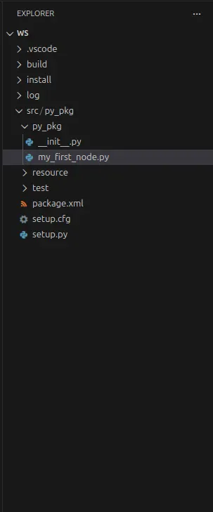

You will find a file named setup.py inside your package as shown in this figure. Go to that file. At the end you will find ‘console_scripts’. Inside the square brackets of console_scripts write the following line as shown in the image below:

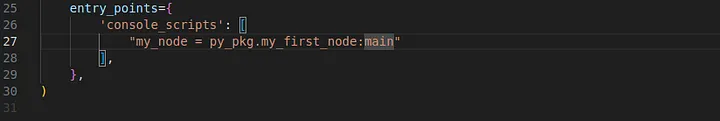

Here basically my_node is the name of your executable, py_pkg is the name of the package inside which your node exists, my_first_node is the name of the file inside which your node exists and main is the function inside which you have written your code to create a node.

Do you remember I earlier said that you will understand why we are writing our code inside the main() function later?

As you can see we wrote our code inside main() function because we need to give the name of the function while we are creating an executable.

Now when we run this executable then main function will run. Our node is inside main() function so our node will also run. main() function will run because we have specified it while creating an executable by writing main at the end in the line:

```python
my_node = py_pkg.my_first_node:main
```

Now save the file. Go to your terminal and make sure you are in the workspace folder. Then run colcon build as shown in the figure given below:

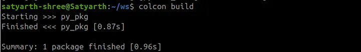

**Important Note: Make sure that you run colcon build only from the workspace folder and not from any other folder.**

All the nodes that you create yourself are stored inside the install folder of the workspace when you run colcon build. So after you build you workspace you need to source the install folder to run the nodes that you create. To do so run the command shown in the figure below:

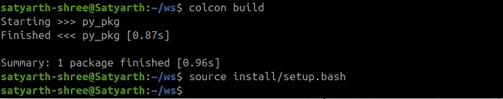

---
## Running Our Node

Now to run your node type the following command:

```bash
ros2 run py_pkg my_node
```

After “ros2 run” first you will type the name of your package inside which your node exists and then the name of the executable. The name of the executable that we wrote in setup.py file is my_node so we will type that.

We will not type the name of the node we have to type the name of the executable which we wrote in console_scripts section of setup.py file.

After running this command you will be able to see the message that we wanted to be displayed is getting displayed as shown in the figure below:

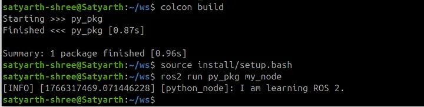

This means your node successfully worked and your message was displayed.

---
## Common Mistakes To Avoid

It is possible that you didn’t see this message getting displayed and you saw some error message instead of this message. Most probably you ran colcon build from the wrong folder or didn’t source the install folder or did some other mistakes. Below are the list of some mistakes which you likely did if your node is not running properly.

Go through it once and most of the problems you are facing will be resolved.

### Mistake 1: Running colcon build from the wrong directory

If you ran colcon build from some other directory instead of your workspace folder then you node won’t work. If you did that mistake then go to that wrong folder and use ls command to check if folders like build, install and log are present inside that folder. If these folders are present in that folder then it is certain that you ran colcon build from that directory.

Simply type the following command in that wrong directory:

```bash
rm -rf build install log
```

Now go to your workspace by typing the following command:

```bash
cd ~/ws/
```

then run “colcon build” command.

Now again try to run your node. If your node is still not running then you are probably doing the next mistake given below.

### Mistake 2: Not sourcing install folder

It is very much possible that you built your workspace correctly but you are still not able to run your node. If you are getting the error shown in the figure given below when you are trying to run your node then you are most probably making this mistake.

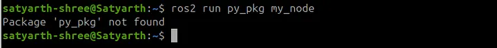

This error means you haven’t sourced ros2 or your install folder correctly. To fix it run these two commands one by one:

```bash
source /opt/ros/jazzy/setup.bash  
source ~/ws/install/setup.bash
```

Replace jazzy with your ROS 2 distribution. If you are using ROS 2 humble then type humble instead of jazzy. Now if you run the command to run your node then you will find that it ran successfully as shown in figure below:

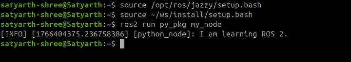

Most of you would have done this mistake. If your node is still not working then you may have done the third mistake.

### Mistake 3: Forgetting to save files

To create this node we basically made changes in two files which are my_first_node.py and setup.py. If you didn’t press ctrl + S to save these files and ran colcon build without saving them then your node won’t work because code related to your node hasn’t been saved and hence was not built when you ran colcon build.

So after making changes first save your file and then run colcon build from the workspace. Now again run the command to source your install folder which is:

```bash
source ~/ws/install/setup.bash
```

And then run the command to run your node which is:

```bash
ros2 run py_pkg my_node
```

### Mistake 4: Syntax Error while Typing Commands

Maybe you ran colcon build and sourced your install folder perfectly but then also you are encountering some errors. You might be making some spelling mistakes or some syntax errors while typing commands because of which the correct command is not getting executed. Make sure you have written commands in the exact same way as I have written in this blog. Do not give unnecessary spaces or change cases of letters from lower to upper or upper to lower. Syntax must be strictly followed.

---
It is possible that you have made some other mistakes and are confused on how you can fix it. I have uploaded the src folder of my workspace on github. I am sharing the link of that github repo. You can check whether you have the same structure and files like I do or not.

Here is the link of the repo: [https://github.com/Satyarth-Shree/ros2-beginner-part-2-python-node](https://github.com/Satyarth-Shree/ros2-beginner-part-2-python-node)

Use this as a reference to check whether your src folder is correctly configured or not.

---
## Conclusion

I hope you understood how you can create a basic node which displays a message. Practice how you can create these nodes from scratch by creating multiple workspaces and nodes from scratch. In this blog you only learned how to create a simple node but you haven’t yet understood nodes completely.

In the next part of this module I will teach you what is a node in greater depth and how you can run and introspect multiple nodes simultaneously. You will gain a complete understanding after reading the next article so do practice this one first.