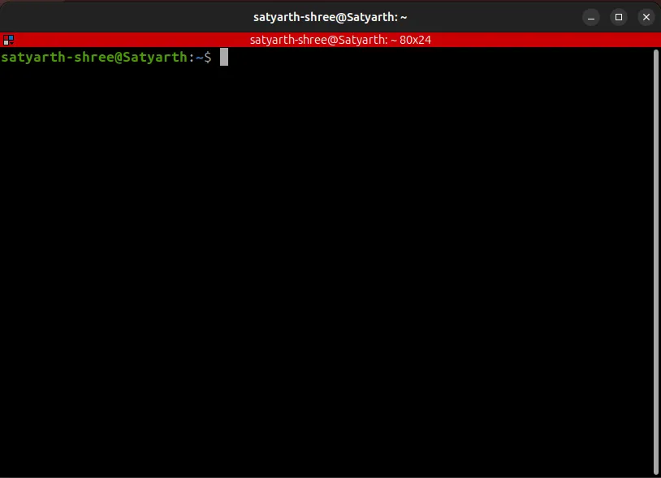
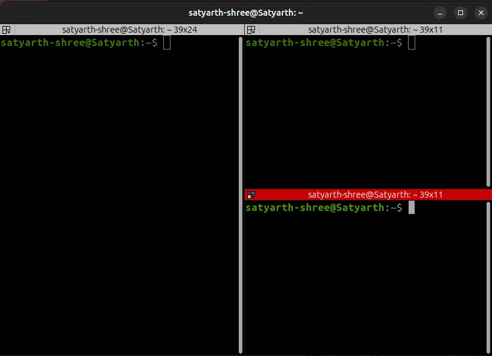
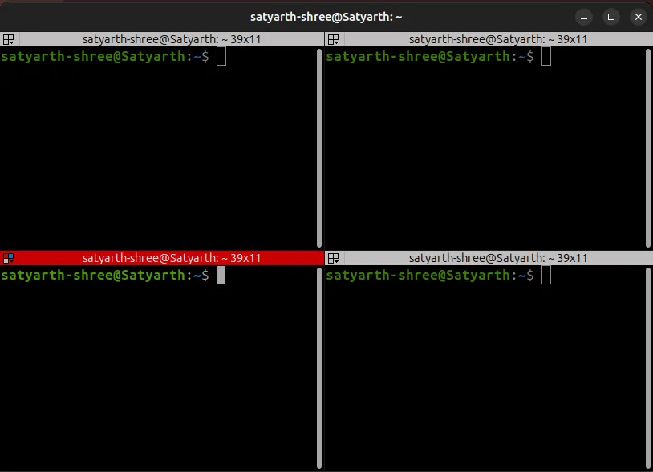
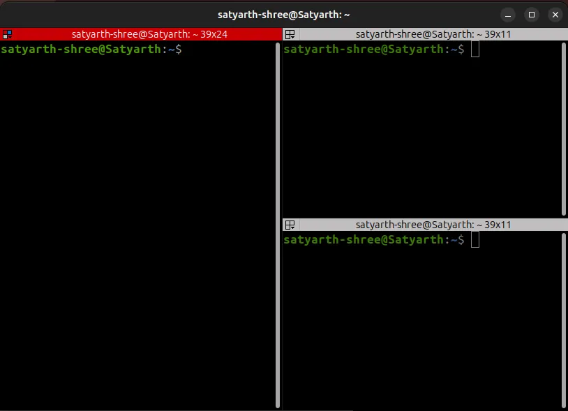
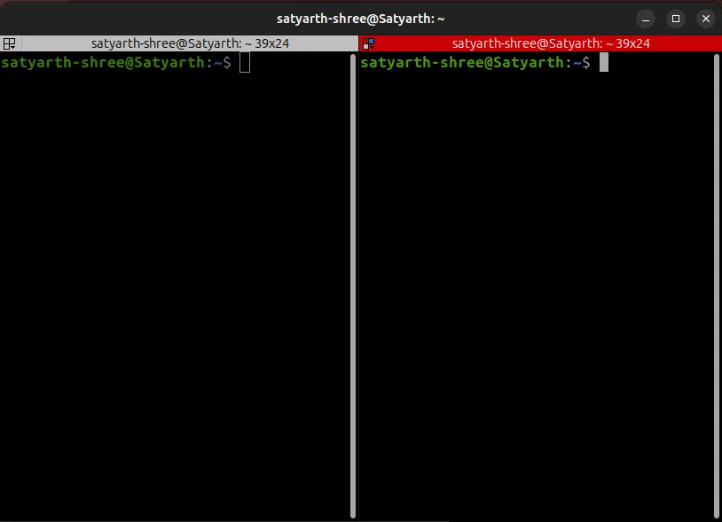

# ROS 2 Tutorial for Beginners (Part 3): Understanding ROS 2 Nodes (Sub Part 1)

## Section 1: Set Your System for a Smoother Workflow

In later sections of this blog when we will run multiple nodes together you will have to open multiple terminals together.

While you can open multiple terminals using the terminal which is pre installed on your Linux system but I recommend using another command line interface known as terminator. In terminator you can split your terminal into multiple terminals without even touching your mouse therefore increasing speed and easiness to navigate and use command line.

To install terminator follow the steps given below:

1. Connect your system to an active internet connection
2. Open your terminal
3. Type the following command: sudo apt install terminator

After you type this command installation of terminator will start. It is a very lightweight command line interface so it won’t take much of your memory and will be installed quickly. Once installation is finished go to your apps section and open terminator. You will see the following interface:



Now click on CLI (Command Line Interface) and press Ctrl + Shift + E and you will see that your terminator has been vertically split into two parts as shown in figure below:


By Ctrl + Shift + E, I meant to say that press Ctrl, Shift and E simultaneously on your keyboard.  
Now click on any one of these parts and press Ctrl + Shift + O and you will see that the part which you have clicked will further split into two horizontal parts as shown in figure below:



Now do the same with the part that is left.

1. Click on it once to select that part
2. Press Ctrl + Shift + O

And you will see that now you have four different command line windows in which you can type and run commands as shown in the figure below:



Now click on any one of these 4 parts to select that part and then press Ctrl + Shift + W. You will notice that doing this will destroy that part and your terminal will now look somewhat like this:



Now again click on one part and press Ctrl + Shift + W. Another part will be destroyed and your terminator will look somewhat like this:



When you open a terminator you will see a single command line interface (CLI). These commands can allow you to create multiple CLI and then destroy them if you don’t need them.

To summarize:

1. Click a CLI to select it and then press
    1. Ctrl + Shift + E to split vertically
    2. Ctrl + Shift + O to split horizontally
    3. Ctrl + Shift + W to destroy that selected CLI window
2. Each part after splitting can be called a window of the Command Line Interface (CLI) which is our terminator.

Although installing terminator is not mandatory but it will help you increase your efficiency once you get a knack of it so I recommend using it.

---
## Section 2: Running a Node

Now let’s run a node. Before running a node you should know how you can run a node. To run a node you have to run a command having the following syntax:

```
ros2 run <package_name> <name_of_executable>
```

A node is always created inside a package so to run a node you have to write the name of the package inside which your node exists. After you have created your node you have to create an executable to run that node. So after writing package name you have to write the name of your executable. Do not write greater than (>) or less than (<) signs when trying to run a node. These are just used while writing syntax.

The name of your executable and the name of your node may or may not be same so don’t get confused.

To simplify you can say there are two types of nodes in ROS 2. They are:

1. Built - In Nodes: These are nodes which are already installed when you install ROS 2. So they can be considered as built-in or pre installed nodes.
2. Custom Nodes: These are the nodes that you create yourself.

There is a small change in the procedure to run Built - In and Custom Nodes which we will discover in subsequent sections of this blog.

First we will discuss how to run a built - in node by running a few of them.

### Running a Built - In Node

The first step before running a ROS 2 command is to source ROS 2. To source ROS 2 type the following command:

```bash
source /opt/ros/<distro>/setup.bash 
```

Replace `<distro>` by your ROS 2 distribution. If you are using humble then you should execute the following command:

```bash
source /opt/ros/humble/setup.bash
```

If you are using Jazzy then you should write:

```bash
source /opt/ros/jazzy/setup.bash
```

Simply replace <distro> by your ROS 2 distribution as shown above.

We are going to run a built-in node which publishes messages. To do so after sourcing your ROS 2 environment split your terminator CLI into four windows (as already discussed above) and run the following command in one of those windows:

```bash
ros2 run demo_nodes_cpp talker
```

You will start seeing a series of “Hello World” messages getting displayed as shown in the figure below:


