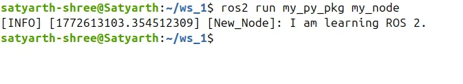
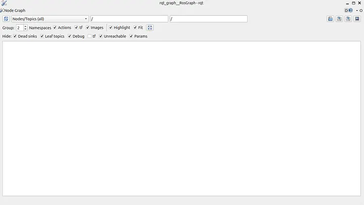
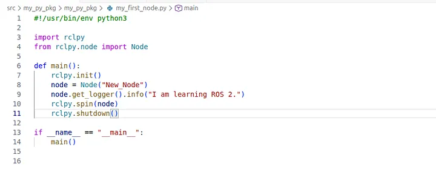
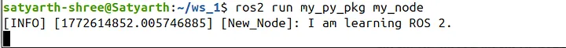
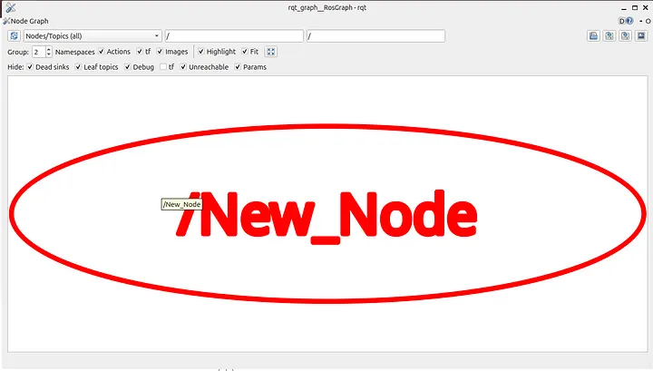
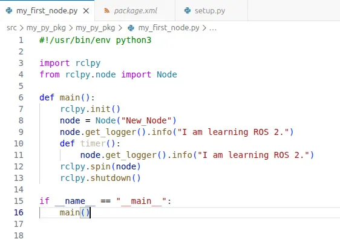
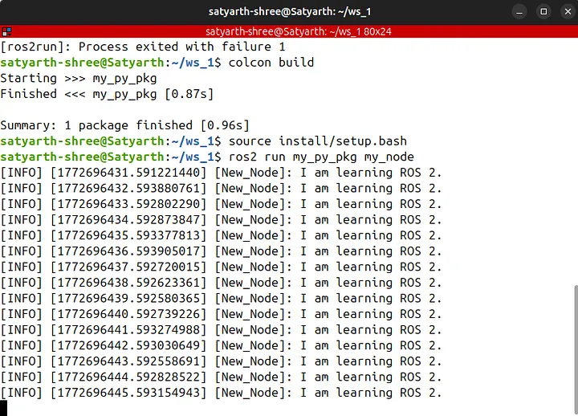
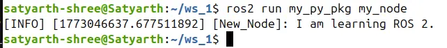
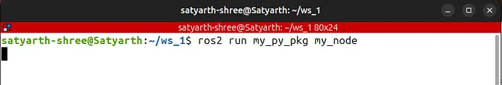
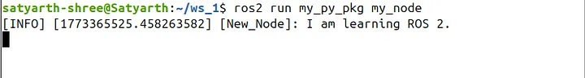

# ROS2 Tutorial for Beginners (Part 4): Understanding rclpy.spin()

**Satyarth Shree** · 13 min read

Learn how `rclpy.spin()` keeps your ROS 2 node alive and how to structure nodes cleanly using Python classes.

## About This Article

This article is the 4th part of my [ROS 2 Tutorial for Beginner series](https://rossimplified.substack.com/p/get-started-with-ros-2). In part 2, I discussed how you can create a simple node which prints a message. This article is a direct continuation of that part. In that part we didn't covered how we can keep a node alive or running.

You should know the following concepts before continuing to read this part:

1. How to create a workspace
2. How to create a package
3. How to create a basic python node which displays a message
4. How to run a python node
5. How to build and source ROS workspace

All these concepts have been covered in the previous parts of this ROS 2 Tutorial series. To read them you can visit the following link:

[ROS 2 Tutorial for Beginners Series By ROS Simplified](https://rossimplified.substack.com/p/get-started-with-ros-2)

If there is a time constraint and you want to continue reading this blog directly then I recommend you clone the following Github repo:

[GitHub — Satyarth-Shree/ros2-beginner-part-2-python-node](https://github.com/Satyarth-Shree/ros2-beginner-part-2-python-node)

Follow the instructions written in README.md file of this repo. After cloning and building this repo successfully you will get a ready made node.

I highly recommend you to read other parts of this series, especially Part 2 before continuing with this article.

## Analyzing behavior of rclpy.spin() in a Node

Let's create a basic node which displays a message like we created in Part 2 of this series.

The code for that node is:

```python
#!/usr/bin/env python3

import rclpy
from rclpy.node import Node

def main():
    rclpy.init()
    node = Node("New_Node")
    node.get_logger().info("I am learning ROS 2.")
    rclpy.shutdown()

if __name__ == "__main__":
    main()
```

Let's build and run this node.

> I am not going to explain in detail on how to run this node because I have already covered that in part 2 of this tutorial series.

We will get the following output (I have used "my_node" as the executable name):

 <br>
 _Figure 1: Node output without rclpy.spin() — the node prints its message once and terminates_

So basically what is happening here? As you can see in the screenshot shared above, when we ran the command to execute our node then our node got executed, it displayed the output and then it stopped. By stopping I mean now our node is not running or we can say it isn't alive anymore.

To check whether our node is currently running or not we can us tools like rqt_graph.

rqt_graph is basically a tool using which we can check which node is running and how nodes are communicating with each other. I have explained about it in part 3 of this tutorial series.

Run the following command:

```bash
rqt_graph
```

The following interface will open:

 
<br>_Figure 2: rqt_graph interface — no node name displayed since the node already terminated_

Press the refresh icon on the top left of the graph. When you will press it you can see that no node name is being displayed which means that no node is currently actively running.

First question which may come up in your mind is:

**Why keeping a node alive is important?**

When we will explore ROS more in upcoming articles you will learn that the publisher and subscriber system is actually a very important method of communication between different nodes.

Without learning how to keep a node alive you cannot create this system.

Therefore it is important to know how to keep a node alive.

To keep a node alive you just need to add one line. The node we have created just now prints a simple message but dies just after that message is displayed. To make sure it runs even after the message is displayed add the following line just above the rclpy.shutdown() line:

```python
rclpy.spin(node)
```

Now our code should look like:

 <br>_Figure 3: Updated code with rclpy.spin(node) added just above rclpy.shutdown()_

We used the variable "node" while we were creating our node in the line:

```python
node = Node("New_Node")
```

Which is the reason why we used the variable name "node" inside parenthesis of spin() because "node" represents the node which displays the message in our program.

spin() function must be used before the line:

```python
rclpy.shutdown()
```

Because this line terminates the ROS communication system. Since this line shuts down the ROS 2 system so we need to make sure that it is always at the end after all our code related to our node is written.

Now run these two commands one by one:

1. `colcon build`
2. `source install/setup.bash`

These two commands must be executed from the root of your workspace folder. As you might already know running these two commands are necessary to build our workspace and then source the newly built version.

Now run your node. You will now notice that even after your message has been displayed the node hasn't been terminated yet. Consider the figure below:

 <br>_Figure 4: Node remains alive after displaying its message, thanks to rclpy.spin(node)_

To check whether the node is alive or not open another terminal while keeping the current one running and type:

```bash
rqt_graph
```

After refreshing the graph you will see that a node name "New_Node" is being displayed as shown in the figure below:

<br>
_Figure 5: rqt_graph now shows "New_Node" as an active node_

This means our node is alive.

As you can see earlier we didn't used **rclpy.spin(node)** because of which our node got terminated immediately after displaying the message but when we used the spin() function then even after displaying the message our node is still alive.

This is the importance of the spin() functionality. It can keep nodes alive which is necessary for continuous communication between two nodes like a publisher and subscriber based system.

The point of our discussion so far is that I want you to understand how you can keep a node alive.

From this discussion we can conclude that there are two types of nodes. The first one terminates immediately after performing it's function while the second one remains alive until we terminate it manually.

There is no such strict classification, I have only put it in this way so you can create a mental model of what we are discussing in your mind.

To terminate a node which is alive, click once on the terminal where you typed the command to run it and then press Ctrl + C.

## An Application of rclpy.spin()

Instead of trying to cram what is happening here we will try to understand what is the importance of **rclpy.spin()** by applying it.

Let's try to create a node which displays a certain message periodically. Since we have to display a message again and again so we need to keep our node alive.

But that is only one side of it. By only keeping a node alive you cannot get it to display a message multiple times. To do so we need to implement a function which displays the message which we want to and use a functionality to call that function periodically.

So in this section we are basically going to learn two things:

1. How to keep a node alive
2. How to implement a timer function

Currently our node somewhat looks like:

```python
#!/usr/bin/env python3

import rclpy
from rclpy.node import Node

def main():
    rclpy.init()
    node = Node("New_Node")
    node.get_logger().info("I am learning ROS 2.")
    rclpy.spin(node)
    rclpy.shutdown()

if __name__ == "__main__":
    main()
```

We have to create a function which displays the message "I am learning ROS 2." and then we need to find a way to call this function periodically.

Let's name our function timer.

Since purpose of this function will be to display our message so we will add the following line inside it:

```python
node.get_logger().info("I am Learning ROS 2.")
```

We have already included this line in our main() function, but it has to be again included inside the new function which we are creating because we want it to get displayed again and again.

Another important point is that our function named timer() must be created inside the main() function.

But why?

Because whenever we type the command to run this particular node, it always executes the main function as we have included the following line in our setup.py file:

```python
my_node = my_py_pkg.my_first_node:main
```

So the code related to our node must always be included inside main function.

As stated earlier we have created a function named timer which is:

```python
def timer():
  node.get_logger().info("I am learning ROS 2.")
```

Now our node looks like:

 
<br>_Figure 6: Code with the timer() function added inside main()_

So we have created a function which displays the message that we have intend to, but will the node display the message periodically as we want it to display?

The answer is No!

But why?

Because even if we have created our function we haven't called it yet so it won't be getting used when we run our node.

ROS offers us a method named create_timer() which let's us call a function every time after a set duration. If I want to call this function named timer() after every 1 second then I will simply add the following line of code below this function (just above the "rclpy.spin(node)" line):

```python
node.create_timer(1.0, timer)
```

The second argument of this function is the name of the function which needs to be executed and the first argument is the time interval between two consequent executions.

Now the complete code is:

```python
#!/usr/bin/env python3

import rclpy
from rclpy.node import Node

def main():
    rclpy.init()
    node = Node("New_Node")
    node.get_logger().info("I am learning ROS 2.")
    def timer():
        node.get_logger().info("I am learning ROS 2.")
    node.create_timer(1.0, timer)
    rclpy.spin(node)
    rclpy.shutdown()

if __name__ == "__main__":
    main()
```

Let's build our package and run our node. You will see that our message is getting displayed after every 1 second as shown in the figure given below:


<br>_Figure 7: Message printed repeatedly every 1 second via the timer callback_

Why is our message getting displayed every 1 second?

This is because we have added the following line:

```python
node.create_timer(1.0, timer)
```

> This line is basically calling timer() function after every 1 second. If we enter some other number in place of 1.0 then our function will be called every time after that specific duration of time.

If we replace 1.0 by some other time duration, let's say 2.0 then this message will be displayed periodically after every 2 seconds.

To understand the importance of the rclpy.spin(), let's remove the following line from our code:

```python
rclpy.spin(node)
```

Now it will be fun to see happens when we build and run our node again.

You will get the following output:

 

_Figure 8: Without rclpy.spin(), the timer callback never fires — no repeated messages_

Message won't be displayed again and again.

Now the question arises why?

To answer that question you need to understand that what happens when the following line is executed:

```python
node.create_timer(1.0, timer)
```

Then you are basically saying:

> "Hey ROS 2, call the function timer() after every one second for me."

This line doesn't calls the function. It only passes the function as a reference ROS 2.

After this function is registered as a reference then the interpreter (translator which executes our python code) moves to the next line which is:

```python
rclpy.shutdown()
```

This line shuts down the ROS 2 system.

So basically the thing that is happening here is that our ROS 2 system doesn't gets a chance to call that function.

ROS 2 can call the function timer(), but only when the node is spinning. To make our node spin we add the following line:

```python
rclpy.spin(node)
```

Once this line is added then our node starts spinning and now ROS 2 calls the function again and again after the specified duration of time.

The spin() function basically starts a ROS 2 executor loop which is necessary for timers to work.

Below are some flowcharts which will help you understand what is happening.

### What happens without spin()

```
start program
     │
     ▼
create node
     │
     ▼
print log message
     │
     ▼
create timer (just registers callback)
     │
     ▼
shutdown
     │
     ▼
program ends
```

### What happens with spin()

```
create timer
     │
     ▼
spin(node)
     │
     ├─ wait
     ├─ wait
     ├─ 1 second passed
     │
     ▼
call timer()
     │
     ▼
print message
     │
     ▼
repeat forever
```

True understanding can only be built once you deliberately try to break the code by experimenting with it continuously.

Now we will do some experimentation with our ROS 2 node to build an even deeper understanding about it.

Make sure to follow along by creating the node yourselves.

Now I will be inserting the line: rclpy.spin(node) just after the line where we have created the node. So now we have the following code:

```python
#!/usr/bin/env python3

import rclpy
from rclpy.node import Node

def main():
    rclpy.init()
    node = Node("New_Node")
    rclpy.spin(node)
    node.get_logger().info("I am learning ROS 2.")
    def timer():
        node.get_logger().info("I am learning ROS 2.")
    node.create_timer(1.0, timer)
    rclpy.shutdown()

if __name__ == "__main__":
    main()
```

Now let's build and run our node again.

You will find something in interesting. The output which you will get will be:

 <br>_Figure 9: No output at all — spin() placed before the log line blocks everything after it_

As you can see no output has been displayed. If you try to understand why this happens then you won't find this surprising anymore.

Take a good look at the code that I shared above. The line responsible for displaying the message is:

```python
node.get_logger().info("I am learning ROS 2.")
```

But before this line I have added the following line:

```python
rclpy.spin(node)
```

This line blocks interpreter from executing our code so the line which comes after this one do not get executed.

The lines which come after the spin() function are not permanently skipped. They will be executed after spinning stops.

After gaining command over the basics of spin() function we will also explore how to stop spinning. For now that part is not the scope of this tutorial blog.

Now let's insert the line:

```python
rclpy.spin(node)
```

just before the line where the timer() function is been defined. So now our code is give below:

```python
#!/usr/bin/env python3

import rclpy
from rclpy.node import Node

def main():
    rclpy.init()
    node = Node("New_Node")
    node.get_logger().info("I am learning ROS 2.")
    rclpy.spin(node)
    def timer():
        node.get_logger().info("I am learning ROS 2.")
    node.create_timer(1.0, timer)
    rclpy.shutdown()

if __name__ == "__main__":
    main()
```

Try to predict the what shall be the output once we build and run this node. The hint is that the spin() function blocks the further execution of our code.

Many of you might have guessed the answer correctly. Since the line:

```python
node.get_logger().info("I am learning ROS 2.")
```

is written before spin() function so it will be executed and our message will be displayed once. The timer() function and the line which is used to create timer comes after the line of spin() function so they won't be executed.

The output that you will obtain will be:

 <br>_Figure 10: Message prints once — spin() blocks the timer creation code that comes after it_

As you can see message was not displayed multiple times because the lines of code required to do so didn't got executed.

So what is the point of this discussion?

Before introducing any definition of spin() function I decided to first explain you how it works practically so that you can easily understand once I write the textbook definition of it.

> spin() starts the ROS executor loop and continuously processes callbacks such as timers, subscriber callbacks, and service requests until the node is shut down.

This is how I define the spin() function. It might not be the official one but it captures the application of the spin() function according to my level of understanding.

Terms like "subscriber" and "service request" might seem confusing to you because we haven't explored them yet. But don't worry in the upcoming parts of this ROS tutorial series I will explain them also.

For now you can keep in mind that just like timers which we discussed in this blog, subscribers and services that we create in ROS also need the involvement of spin() function.

This is the end of our discussion for this part. If you have any doubts then you can drop a comment in the comments section below and I will try to reply as soon as possible.

> I am currently a full-time BTech student managing my studies alongside learning ROS2 and writing these tutorials, so my schedule can sometimes be quite busy. Thank you for your patience and for following along with the series.

## What's Next

In the next part of this blog I shall discuss how you can create a node using classes in python. Almost all industry grade code always uses classes so we should also learn how we can create node using it.

In this blog we tried to use the spin() function to display a message periodically. In the next one we will try to achieve the same outcome but by using classes.

> Stay Tuned and Keep Learning!

**Edit:** Next part of this tutorial series has been released. Click here to read it:

[ROS 2 Tutorial for Beginners (Part 5): Managing ROS 2 Workspace Storage Using Linux Commands](https://medium.com/@satyarthshree45/ros2-tutorial-for-beginners-part-5-managing-ros2-workspace-storage-using-linux-commands-f0c0b76c9559)

## A Short Introduction

Hi, I am Satyarth Shree, a first-semester BTech Robotics and Automation student at Lovely Professional University (LPU), India. I am an aspiring robotics engineer who is publicly documenting his learning journey using platforms like Medium and Substack.

My areas of interest include ROS, python and mathematics. Currently, I am focusing on ROS more. I have also started a publication named ROS Simplified to make ROS accessible to everyone by providing beginner-friendly tutorials free of cost.

## Let's Connect

- **My Github**: https://github.com/Satyarth-Shree
- **My LinkedIn**: https://www.linkedin.com/in/satyarth-shree-761357374/
- **My CodeWars**: https://www.codewars.com/users/Satyarth-Shree
- **My X**: https://x.com/BuildUnderdog
- **My Hashnode**: https://hashnode.com/@SatyarthShree
- **My Portfolio**: https://satyarth-shree.github.io/My-Portfolio/
- **To professionally contact me for internships, collaborations or similar opportunities click here**: https://forms.gle/SH9bj1oJwqPtJtD26

---

**Tags:** Ros 2, Robotics, Robotics Engineering, Programming, Ros 2 Tutorial