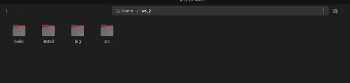
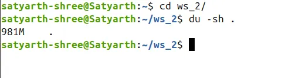
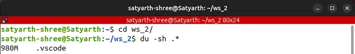
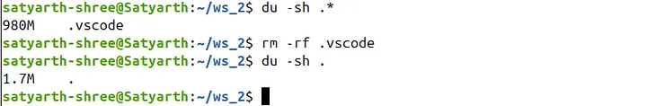
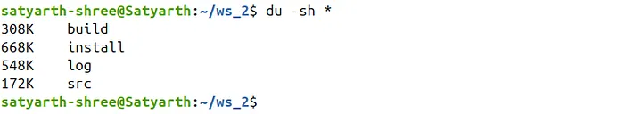

# ROS2 Tutorial for Beginners (Part 5): Managing ROS2 Workspace Storage Using Linux Commands

**Satyarth Shree** · 8 min read

> Using simple Linux commands to identify and manage the folders that occupy most of your ROS2 workspace storage.

ROS 2 is not a programming language, it is a complex middleware which demands deliberate practice and consistent efforts to learn and master it completely.

While dealing with such a framework we often create multiple workspaces which overtime tends to occupy a huge amount of space. We do not notice this issue until our system starts facing performance issues like continuous lagging because of less storage left.

Robotics Engineers or ROS experts who are already working in robotics industry might have access to better systems which are having huge amount of storage, so this issue might not be a problem for them.

But there are many university and college going students like me who are learning ROS2 and do not have access to such systems. Many of us use old laptops because as students our budget is also limited.

I myself have a laptop that doesn't has powerful NVIDIA GPU or 1 TB storage.

So moving forward people we need to focus on optimizing our systems more so that even under hardware constraints we can still learn ROS.

Because of these hardware constraints of my laptop I was only able to allocate 70 GB of storage to my Linux operating system while I was dual booting it with my Windows 11.

If I keep creating workspaces blindly then I will exhaust these 70 GB's very soon. To make sure that doesn't happen I learned some Linux commands to make the most out of the storage that I have.

I am sure there are many people out there who are facing a similar situation especially beginner ROS2 learners.

Even if you have a laptop that has 1 TB storage it is always good to learn how to manage the storage occupied by your ROS2 workspace so that you won't face any issues later on.

This is the 5th part of my ROS2 Tutorial Series. To view other parts click here: [ROS 2 Tutorial for Beginners Series](https://rossimplified.substack.com/p/get-started-with-ros-2-a-beginner)

> Now let's continue

## Managing storage occupied by a ROS2 Workspace

Use the split screen feature of your system to open this blog and your terminal simultaneously so that you can follow along and use the commands which I will be discussing in this part.

### Checking Storage Left on Your Linux Partition

Most of you reading this blog might have dual booted your windows operating system to install Linux. So first we need to know how to check storage left on our Linux partition.

Open your terminal and type the following command:

```bash
df -h
```

You will get the following output:

 
_Figure 1: Output of the command "df -h"_

This command is used to check the storage occupied by each partition on your SSD.

Under the "Mounted on" section you can see the following symbol: `/`

This symbol represents the root directory of your Linux OS, which means that this is the partition where your Linux file system is installed.

Your system will also show this symbol under the "Mounted on" section. The information like storage size, storage used and storage available corresponding to this symbol is the storage characteristics of your Linux Partition.

As you can see corresponding to this symbol, my system is showing the following data:

```
Filesystem      Size  Used Avail Use% Mounted on
/dev/nvme0n1p6   69G   34G   32G  52% /
```

This means that I have allocated a total of 69 GB to Linux out of which 34 GB is used and 32 GB is available.

The sum of 32 and 34 GB is 66 GB. I have allocated a total of 69 GB to Linux so where is the other 3 GB?

Linux reserves some space for system operations to avoid crashing of OS when very less storage is left which is the reason why we can't see those 3 GB here.

This command is very useful as it allows you to instantly check how much storage is left for you to use.

### Checking Storage occupied by Your ROS 2 Workspace

A simple method to check storage occupied by your workspace is to open your files app then right click on the workspace folder and then click on "Properties" option.

But this method has one flaw. It will show you the total storage occupied by your workspace but, it won't be able to show you any hidden files or folders which are quietly consuming your space.

I have opened one of my workspace folders in files app and I can see these 4 folders inside it:

 
_Figure 2: Viewing ROS 2 workspace using Files app of Linux OS_

As expected inside a ROS 2 workspace, we can see 4 folders named build, install, log and src.

But the question is are there really only these four folders inside your workspace?

> The answer is NO!

There is a hidden folder which is quietly consuming more than 90% of the space of your workspace and is not off much use so removing it is completely safe.

> The question is which folder is this?

Almost all of us use VS Code whenever we are working on our workspace because it offers various extensions and features like auto complete.

VS code generates a hidden folder named `.vscode` inside our workspace which quietly grows very large over time.

This folder has no relation with ROS 2 so wiping it won't do any damage to any of our nodes or packages that we have created.

Now let's practically perform what we discussed just now.

Navigate inside one of your workspace folder using the "cd" command. The name of my workspace is folder is "ws_2", so I will write the following command:

```bash
cd ws_2/
```

Now run the following command to check total storage occupied by your workspace:

```bash
du -sh .
```

This command will give you the total storage occupied by various files and folders inside your workspace including the hidden ones also.

As you can see the total storage occupied by my workspace is 981 MB:

 
_Figure 3: Storage occupied by my workspace_

Now comes the most surprising part. Run the following command:

```bash
du -sh .*
```

This command displays the storage occupied by hidden files and folders.

When I ran this command this is what I found:


_Figure 4: Output of command: du -sh ._

Out of 981 MB, 980 MB is being occupied by a hidden folder named `.vscode`, which means more than 99% storage is occupied by a single folder.

This folder is created by VS Code when we are working on a workspace and grows very large in a short duration of time. It has no relation with the core functionalities of ROS 2, so deleting it won't cause any harm to your workspace.

You might have multiple workspace and a huge portion of them is being consumed by this hidden folder which is not of any direct use to you, so cleaning it will free several GB's of your storage depending on how many workspace you have on your system.

Even if you delete the `.vscode` folder it will get created again once you open your workspace on VS Code. So after every ROS working session make sure you run a simple command which I am going to tell you next so as to free your storage.

```bash
rm -rf .vscode
```

This command will wipe out `.vscode` folder along with the contents inside it.

As you can see after deleting `.vscode` folder the actual size of my workspace has been reduced to 1.7 MB:

 
_Figure 5: Storage occupied by workspace after deleting .vscode folder_

Earlier the size of my workspace was 981 MB. Now it has been reduced to 1.7 MB, which means I have freed up nearly 979.3 MB of data.

So I can say that approximately 1 GB of data has been freed up. If you do this with every workspace then you will free up multiple GB's of data.

The following command is used to check the storage occupied by your files and folders (excluding the hidden ones):

```bash
du -sh *
```

As you can see using this command now I can check how much storage is occupied by which folder:

 
Figure 6: Output of command: du -sh

The actual storage occupied by the important folders of our workspace is very less compared to the storage which was earlier occupied by the hidden folder — `.vscode`.

I am sharing a summary of commands which were discussed in this blog so that you can use it for future reference.

> `df -h` → Used to check storage occupied by each partition on our SSD
> 
> `du -sh .` → Total storage occupied by a folder including hidden files and folders
> 
> `du -sh .*` → Used to check storage occupied by hidden files and folders inside a folder
> 
> `du -sh *` → Used to check storage occupied by files and folders inside a folder excluding the hidden ones
> 
> `rm -rf .vscode` → Used to delete .vscode folder present inside a workspace or a folder

## Conclusion and What's Next

This is all for this part. In next part we will discuss how you can create a publisher and subscriber system on ROS. The upcoming part will be very important as we will be using ROS 2 communication systems for the very first time.

**Edit:** Next part has been released!! [Click here to read it.](https://medium.com/@satyarthshree45/ros-2-tutorial-for-beginners-part-6-topics-and-publisher-foundations-09b493c64bce)

If you want to get updates of tutorials like these directly into your inbox then [subscribe to my publication by clicking here](http://rossimplified.substack.com/).

## About The Publication: ROS Simplified

_ROS Simplified_ is a learner-driven publication dedicated to making ROS (Robot Operating System) concepts clear, practical, and accessible. We provide tutorials, conceptual explainers, and project walkthroughs designed to help students, hobbyists, and engineers understand and apply ROS efficiently.

This blog has also been published under the publication — [ROS Simplified](http://rossimplified.substack.com/).

[To view other parts of this ROS 2 Tutorial series click here.](https://rossimplified.substack.com/p/get-started-with-ros-2-a-beginner)

## About The Author

Hi, I am Satyarth Shree, a second-semester BTech Robotics and Automation student at Lovely Professional University (LPU), India. I am an aspiring robotics engineer who is publicly documenting his learning journey using platforms like Medium and Substack.

My areas of interest include ROS, python and mathematics. Currently, I am focusing on ROS more. I have also started a publication named ROS Simplified to make ROS accessible to everyone by providing beginner-friendly tutorials free of cost.

## Let's Connect

- **My Github**: https://github.com/Satyarth-Shree
- **My LinkedIn**: https://www.linkedin.com/in/satyarth-shree-761357374/
- **My CodeWars**: https://www.codewars.com/users/Satyarth-Shree
- **My X**: https://x.com/BuildUnderdog
- **My Hashnode**: https://hashnode.com/@SatyarthShree
- **My Portfolio**: https://satyarth-shree.github.io/My-Portfolio/
- **To professionally contact me for internships, collaborations or similar opportunities click here**: https://forms.gle/SH9bj1oJwqPtJtD26

---

**Tags:** Ros2, Linux, Robotics, Command Line, Software Engineering