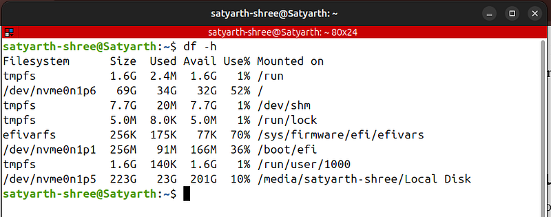

# ROS2 Tutorial for Beginners (Part 5): Managing ROS2 Workspace Storage Using Linux Commands

> **Using simple Linux commands to identify and manage the folders that occupy most of your ROS2 workspace storage.**

ROS 2 is not a programming language, it is a complex middleware which demands deliberate practice and consistent efforts to learn and master it completely.

While dealing with such a framework we often create multiple workspaces which overtime tends to occupy a huge amount of space. We do not notice this issue until our system starts facing performance issues like continuous lagging because of less storage left.

Robotics Engineers or ROS experts who are already working in robotics industry might have access to better systems which are having huge amount of storage, so this issue might not be a problem for them.

But there are many university and college going students like me who are learning ROS2 and do not have access to such systems. Many of us use old laptops because as students our budget is also limited. 

I myself have a laptop that doesn’t has powerful NVIDIA GPU or 1 TB storage.

So moving forward people we need to focus on optimizing our systems more so that even under hardware constraints we can still learn ROS. 

Because of these hardware constraints of my laptop I was only able to allocate 70 GB of storage to my Linux operating system while I was dual booting it with my Windows 11.

If I keep creating workspaces blindly then I will exhaust these 70 GB’s very soon. To make sure that doesn’t happen I learned some Linux commands to make the most out of the storage that I have.

I am sure there are many people out there who are facing a similar situation especially beginner ROS2 learners.

Even if you have a laptop that has 1 TB storage it is always good to learn how to manage the storage occupied by your ROS2 workspace so that you won’t face any issues later on.

This is the 5th part of my ROS2 Tutorial Series. [To view other parts click here.](https://rossimplified.substack.com/p/get-started-with-ros-2-a-beginner)

> Now let’s continue

## Managing storage occupied by a ROS2 Workspace

Use the split screen feature of your system to open this blog and your terminal simultaneously so that you can follow along and use the commands which I will be discussing in this part.
### Checking Storage Left on Your Linux Partition

Most of you reading this blog might have dual booted your windows operating system to install Linux. So first we need to know how to check storage left on our Linux partition.

Open your terminal and type the following command:

```bash
df -h
```

You will get the following output:



This command is used to check the storage occupied by each partition on your SSD.

Under the “Mounted on” section you can see the following symbol: /

This symbol represents the root directory of your Linux OS, which means that this is the partition where your Linux file system is installed.

Your system will also show this symbol under the “Mounted on” section. The information like storage size, storage used and storage available corresponding to this symbol is the storage characteristics of your Linux Partition.

As you can see corresponding to this symbol, my system is showing the following data:


```bash
Filesystem      Size  Used Avail Use% Mounted on  
/dev/nvme0n1p6   69G   34G   32G  52% /
```


This means that I have allocated a total of 69 GB to Linux out of which 34 GB is used and 32 GB is available.

The sum of 32 and 34 GB is 66 GB. I have allocated a total of 69 GB to Linux so where is the other 3 GB?

Linux reserves some space for system operations to avoid crashing of OS when very less storage is left which is the reason why we can’t see those 3 GB here.

This command is very useful as it allows you to instantly check how much storage is left for you to use.

### Checking Storage occupied by Your ROS 2 Workspace

A simple method to check storage occupied by your workspace is to open your files app then right click on the workspace folder and then click on “Properties” option.

But this method has one flaw. It will show you the total storage occupied by your workspace but, it won’t be able to show you any hidden files or folders which are quietly consuming your space.

I have opened one of my workspace folders in files app and I can see these 4 folders inside it: