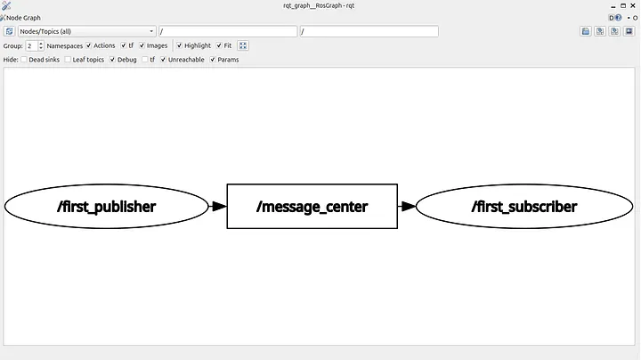
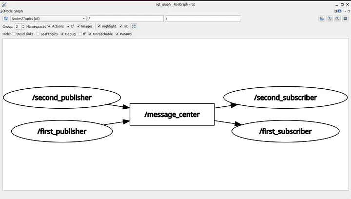

# ROS 2 Tutorial for Beginners (Part 6): Topics and Publisher Foundations

**Satyarth Shree** · 18 min read · Apr 15, 2026

> Learn how ROS 2 topics enable communication between nodes and start building the foundation of your first publisher using Python

## What we've covered so far

In the previous 5 parts we have basically covered the following concepts:

1. Creating a workspace
2. Creating a package
3. Creating a node which displays messages
4. Introspecting nodes using command line tools
5. Managing workspace storage using Linux commands

There is something common about all of these concepts. None of them uses ROS 2 communication systems effectively.

A node which displays messages just prints them on the terminal, which can even be done by a simple python file.

You are not utilizing ROS effectively if you are not using it's communication systems. In the previous parts, I didn't talk about this because it was necessary to first cover the basics like creating a package and then creating a very basic node inside it.

But now since we have already covered the basics so it's time to start utilizing the communication mechanisms provided by ROS 2.

After reading this blog you will be yourself be able to create a system where different nodes communicate with each other.

> So let's start learning

**This article has been published under a publication named** [**ROS Simplified**](http://rossimplified.substack.com/) **which is a learner driven publication dedicated to make ROS 2 easy to understand and accessible for beginners.**

## The Publisher — Subscriber System Explained

This is one of the most beginner friendly concepts in ROS 2 from where we can start learning how communication between different nodes work.

Before you try to understand this system you should read previous parts as the concepts that I have taught there will be actively used in this article.

I have already mentioned the concepts which I have discussed in previous parts in the **"What we have covered so far"** section of this blog. If you are already aware of those concepts then you can continue with this article.

> Now I will start explaining what a publisher — subscriber system really is in ROS 2.

Instead of copy pasting bookish definitions I will tell you about my understanding of this system.

So basically publisher can be defined as a **node** which publishes messages to a **topic** in ROS 2.

As I said this may not be the bookish definition of publishers but it summarizes what happens practically whenever we run a publisher node.

> Now you might be thinking what is a topic?

Let's start by a simple analogy.

We all have used platforms like Youtube where we can watch videos posted by content creators.

Let's assume you have subscribed to a Youtube channel named "ROS Simplified". Whenever someone will post a video on this channel then you will get a notification.

If no video is posted then you won't receive any notifications.

This is exactly what happens in a publisher — subscriber system.

A publisher node publishes messages to a topic. Any subscriber node which subscribes a topic will receive all the messages which are being published on that topic.

To correctly visualize the data flow look at the image shown below:

 _Figure 1: Data flow in a publisher-subscriber system_

Here I have created a publisher node named "first_publisher" which is publishing some data on a topic named "message_center". A subscriber node named "first_subscriber" has subscribed to this topic, so whenever a message gets published on this topic, first_subscriber will receive it.

This is the actual data flow that happens in a publisher — subscriber model.

More than one publishers can publish on a topic.

The same goes for subscribers.

More than one subscribers can subscribe to a topic.

It is also possible that a topic has a publisher but no subscribers or has subscribers but no publishers.

> Relate this with the Youtube analogy which I mentioned earlier.

It is possible for a youtube channel to have a content creator that is consistently publishing videos but hasn't gained any subscribers yet.

This can be related with a topic having publishers, but no subscribers.

It is also possible for a youtube channel to have subscribers but now the creator of that channel is no longer posting videos. We often call such a youtube channel a "**dead channel**".

This can be related with a topic having subscribers, but no publishers.

Refer the diagram given below to get a better understanding of what we are discussing here.

 _Figure 2: A topic having more than one publishers and subscribers._

As you can see in figure no.2 our topic which is message_center, has more than one publisher and more than one subscriber.

Here is a more in depth overview of what is happening.

The publishers which are: **first_publisher** and **second_publisher** are publishing messages to the same topic named **message_center**.

The subscribers which are: **first_subscriber** and **second_subscriber** have subscribed to this topic, so all the messages which are being published in this topic will be received by both the subscribers.

Many beginners have a misconception that first_subscriber will receive data published by first_publisher and second_subscriber will receive data published by second_publisher.

So they build a mental model like this:

```
+-------------------+        +---------------------+
| first_publisher   | -----> | first_subscriber     |
+-------------------+        +---------------------+

+-------------------+        +---------------------+
| second_publisher  | -----> | second_subscriber    |
+-------------------+        +---------------------+
```

> But this is wrong!

> In reality, a subscriber which has subscribed to a topic will receive data from all the publishers publishing to that topic.

So first_subscriber is receiving data from both first_publisher and second_publisher.

The same goes for second_subscriber.

The correct mental model is:

```
            +-------------------+
            | first_publisher   |
            +-------------------+
             |               |
             |               |
             v               v
+---------------------+   +--------------------+
| first_subscriber    |   | second_subscriber  |
+---------------------+   +--------------------+

            +-------------------+
            | second_publisher  |
            +-------------------+
             |               |
             |               |
             v               v
+---------------------+   +--------------------+
| first_subscriber    |   | second_subscriber  |
+---------------------+   +--------------------+
```

You might start getting a bit confused thinking about these publisher-subscriber models and how they communicate with each other.

It is normal to feel overwhelmed because most probably you are studying about internal communication mechanisms of ROS 2 for the very first time.

Don't worry, now I will step by step explain how to create a publisher.

Once you yourself create a publisher and see topics running on your system, you will naturally feel a more firm grasp over these concepts which we discussed just now.

> If you are too much confused, then forget what I have explained till now and focus on what I am going too.

As stated earlier it is highly recommended that you read previous parts before reading this one because concepts taught in those parts will be required to completely understand this one.

Here is the article from where you can start your learning ROS 2: [ROS Simplified for Beginners](https://rossimplified.substack.com/p/get-started-with-ros-2-a-beginner)

> Let's continue

## Creating a Publisher and a Topic

From our discussion till now we can conclude that:

> A publisher is basically a node which publishes messages or some data to a topic.

The important word in the above written line is "node".

That means to create a publisher we need to first create a node.

Let's create a node named "**first_publisher**".

To do so we have to first create a workspace, then create a package inside it and then create a node inside the package.

I have already explained how to do this in [Part 2](https://medium.com/@satyarthshree45/ros-2-tutorial-for-beginners-part-2-creating-your-first-node-c33e92d54b5c) of this tutorial series. If you have a confusion, you can refer from there.

> Make sure to use split screen feature to open this blog and your terminal or VS Code simultaneously so that you can also practice what you are learning.

I am creating a workspace named "**tutorial_part_6**" and a package inside it named "**first_package**". You can choose any name according to your preference.

I have created a file named "**first_node.py**" inside my package.

After doing this much we can start writing the code for our publisher node.

> So complete till this step and then proceed to the next one.

Now open the python file that you have created in VS Code or any other IDE which you prefer.

### Writing Code for a Publisher

The first line which we will write is shebang.

You might be thinking what a shebang is? Let me explain you.

A shebang is a line which tells our operating system (OS), which interpreter should be used to run this file.

The shebang that we will use is:

```bash
#!/usr/bin/env python3
```

This line tells our OS, that python3 should be used to execute this file. python3 here is basically an interpreter which is used to execute a python file.

Shebang must be the very first line that should be written in your python program.

After writing shebang we have to begin writing our main program. Since we are creating a python node so we obviously need rclpy, which is the ROS 2 client library for python.

rclpy cannot be used directly as it is not a built-in library of python. We need to manually import it, so second line of our program will be:

```python
import rclpy
```

> We are basically creating a node here that publishes messages to a topic. To create a node we have to use functionalities of Node class which is present inside the node module in rclpy.

You might be confused after reading what I just said.

Let me break it down for you.

rclpy is a library which has several modules inside it. Each one of these modules are designed for a specific purpose.

Think of a library like a folder and modules like files inside it. So rclpy is basically a folder which has several usable files inside it known as modules.

One of these files is named node.py

It is also called the **node** module. Inside this node module, there is a class named **Node**.

This class provides us with the means to create a node using python in ROS 2. You can yourself check whether this module or class exists or not.

Just search: "**rclpy official github repository**" on any search engine that you are using. Then open the github repository of rclpy.

Inside that repository you will find the node module, and inside that node module you will also find the Node class.

So since we are creating a node here so we need to import this **Node** class.

To do so we will now write the following line:

```python
from rclpy.node import Node
```

So far we have written the following code:

```python
#!/usr/bin/env python3

import rclpy
from rclpy.node import Node
```

It is important to build a mental model of what code we have written so far, so that you truly understand it, instead of ending up memorizing and forgetting it by day after tomorrow.

Here is what we have done till now:

```
+-------------------------------+
|Used shebang to tell the OS    |
|which interpreter should be    |
|used while executing this file |
+-------------------------------+
               │
               ▼
+-------------------------------+
|Imported rclpy to access ROS 2 |
|functionalities using python   |
+-------------------------------+
               │
               ▼
+-------------------------------+
|Imported "Node" class from     |
|"node" module to create a node |
+-------------------------------+
```

Instead of memorizing code try to understand the meaning of each line as written in the flowchart shared above.

Now we will create a class.

You might be thinking why we are creating a class and what is the use of it.

Strictly speaking you can create a python node even without using classes but industry grade code and programs involving very complex coding is almost always written using classes.

So it is better to practice how to use classes from the beginning as it will allow you to gain a firm grasp over it as you progress further in this tutorial series.

Even if you are not much good in Object Oriented Programming part of python, don't worry.

I will be explaining each line of code as we progress further.

> Alright before continuing further there is something I would like to tell you.

Now we will start with the main coding of our publisher. So the upcoming section will be demanding a huge portion of your cognitive bandwidth to understand, especially if you are beginner who has never used ROS extensively before.

If you are feeling tired or you are in an environment where you cannot focus, so I recommend stopping for now and continuing reading later when conditions are better.

> If you are ready then let's go

To create a class we have to use the "**class**" keyword followed by the name of our class.

Let's name our class "**Publisher**".

We will write the following line:

```python
class Publisher(Node):
```

As you can see after Publisher, I have written the Node class inside parenthesis. This is the same Node class which we imported earlier.

Now you might be thinking what is happening here?

Why we are writing Node inside parenthesis while creating some another class?

> This is actually a very important concept in python. It is known as inheritance.

**Inheritance** means when a class inherits methods and attributes from some another class.

The class which inherits methods and attributes from some another class is known as **child class** or **sub class**.

The class from which, another class inherits is known as **parent class** or **super class**.

So in our case **Node** is parent class and **Publisher** is child class, because Publisher is inheriting from Node.

**Inheritance** basically allows the child class to use all the methods and attributes of the parent class as well as it's own methods and attributes.

So the child class basically becomes an extension of the parent class as it has all the attributes of the parent class along with it's own.

> This is actually a very powerful feature. If you are working on an important python project then you can basically create a **Master class** having all the main attributes and functions and several other classes inheriting from this master class.

As I stated earlier that all the functionalities related to a node is defined in the Node class of the official github repository of rclpy.

When we use the concept of inheritance and create the Publisher class then we have now created something using which we can use all the functionalities of the Node class.

> This is exactly why this line which you just wrote is very important.

Without it, you won't be able to create node which can be considered as one of the most fundamental units of a system made using ROS 2.

Now after you have defined your class, you must create a constructor inside it.

A constructor is a special method which is used to initialize the attributes of an object when it is created from a class.

Think of it in this way:

> A class actually defines attributes of the objects created using it. A constructor actually assigns values to those attributes for each object.

To create a constructor you have to create a "`__init__`" function inside your class.

This must be the first function that you should create inside your class.

So now you have written the code up to this point:

```python
#!/usr/bin/env python3

import rclpy
from rclpy.node import Node

class Publisher(Node):
    def __init__(self):
```

As you can see I have created a function named `__init__` inside my class.

This function is the constructor of our class about which we were just talking about.

You might be thinking why we have written "**self**" inside the parenthesis of constructor?

Here "self" represents the objects which we will create using this class. So "self" must be the first argument which should be passed to the constructor.

If you are not good with Object Oriented Programming and you want a dedicated tutorial related to it then you can fill the form given below.

[Click here to fill python OOP tutorial form](https://form.jotform.com/261002073006034)

If sufficient number of people want a tutorial article dedicated to OOP then I will surely create it and publish soon under the publication — ROS Simplified.

> Things can start getting confusing from here especially if you haven't had much programming exposure yet, but bear with me, I will make it easier to understand it for you.

Inside our constructor we will write create our publisher node.

You might be thinking why inside the constructor? Why not inside some another method?

Because whenever you create an object then constructor is automatically called in the background.

This means that all the code written inside the constructor gets executed from top to bottom.

If you have created your function inside some another method of class in place of constructor then you would have to explicitly call that method.

> This is actually a very important concept in OOP. Whenever you create an object from a class then only constructor gets automatically called in the background. To call other methods you have to do it explicitly.

So creating our publisher inside constructor removes the headache of calling some another method of our class.

If you want to structure your code in such a way that you do not want a publisher to be created whenever you create an object then it is the right move to create publisher inside some another method.

How you structure your code depends entirely on which application you are working on.

Since here, we are just learning how to create a publisher so we will be doing it inside the constructor function for simplicity.

Later in these tutorial series when we dive into more advanced topics we will uncover some more aspects about classes. But for now this is enough.

I would like you to take a break here and then process what is the role of each line of code we have written up till here. Rushing to complete a tutorial won't develop conceptual depth, thinking hard and trying to find the meaning of each line of code will.

Remember you have opened this article to learn how to create a publisher not for entertainment.

But the main motive of reading this article shouldn't be just to learn how to create a publisher, but also to develop an understanding of the ROS 2 system on the basis of which you can yourself decide which conditions are required for a publisher to exist.

> That is real conceptual depth.

### Final Stage: Creating a Topic and the Foundation of a Publisher

Only proceed beyond this point when you have fully understood what we have discussed till now.

In ROS 2 every node has a name, so before creating our publisher node we must decide a name for it.

Let's name our publisher node — "publisher_1". You can choose any other name of your preference but the important thing to note is that the name of a publisher shouldn't have blank spaces.

For example, if you want to name your node "my node" then this name won't work because it has a blank space. So name it "my_node". In place of blank spaces you can use the underscore character.

The second important thing to keep in mind is that the name of your node cannot contain special characters like @, #, $, % etc. You can only use underscores. Even hyphens (-) are not allowed.

> ROS 2 node naming convention follows strict rules. Always remember that.

Decide the name of your node accordingly now. I am continuing with the name "publisher_1".

Now inside the constructor we will add the following line:

```python
super().__init__("publisher_1")
```

This line is called **Superclass constructor call** or **Superclass Initialization** or **super() invocation**.

But why?

Because this line class the constructor of our super class which is Node and initializes a node named publisher_1.

We created a constructor for our class Publisher. Just like Publisher the Node class, which is the parent class of Publisher also has a constructor.

If we want to create a node then we must call the constructor of this super class and pass the name of our node as an argument.

As you can see inside the parenthesis of the superclass constructor call line, I have written the name of my node enclosed by double inverted commas.

Now in the background the constructor of the Node class will be called and the node of my name will be passed as an argument to it.

This will initialize our node in the ROS 2 communication system.

The important thing to note is that while passing your node name as an argument to the superclass constructor call, always enclose it inside double inverted commas.

If you don't do so then you will get an error. Let's say I wrote the following statement:

```python
super().__init__(publisher_1)
```

Then python will try to find a variable named publisher_1. Since no such variable exists so it will give an error.

> So make sure that your node name is enclosed inside single or double inverted commas.

So far we have written this much of code:

```python
#!/usr/bin/env python3

import rclpy
from rclpy.node import Node

class Publisher(Node):
    def __init__(self):
        super().__init__("publisher_1")
```

Now we will create a publisher.

Before we start creating a publisher we must first decide the name of the topic on which our publisher will publish messages.

The naming convention of topics is almost the same as nodes with one key difference.

> Topics allow forward slash (/) in their names while nodes don't.

This is an interesting fact about which you should be aware off.

I have decided to use "message_center" as the name of my topic.

Now read very carefully.

Let's revisit the definition of a publisher which we discussed earlier

> A publisher is basically a node that is transmitting a message to a topic.

The important phrase in this definition is:

> transmitting a message to a topic

This is not just a simple phrase. It carries a deep conceptual meaning.

Let me explain.

In ROS 2, there is something known as a "message". Each message has a message type.

So when you are creating a publisher you have to basically specify which message your publisher will be publishing to a topic.

When you are specifying a message you are also specifying the type of that message.

This might be sounding confusing to you, so read carefully.

ROS 2 provides you with the power to create your own custom messages and also define the type of your message.

We often create our own type of messages in complex multi node systems where several publishers and subscribers are involved and we wish to create a useful application out of it.

But for beginners like you and me who are new to ROS, creating our own custom messages is very difficult.

To deal with this issue ROS 2 provides you with Built-In packages that allows you to use pre-built messages.

You can use these pre-built messages to create a publisher of your own, without needing to create custom messages from scratch.

These pre-built messages are stored inside packages. One such package which offers you built-in messages is **example_interfaces**.

Inside the example_interfaces package there is a module named **msg**. This is a module which stores message definitions. Inside this module there is a message type known as **String**.

But we cannot use this package.

Why so?

Because we haven't imported it yet.

To import we have to write the following line, just above the line in which we have created our class Publisher:

```python
from example_interfaces.msg import String
```

Now our code looks like:

```python
#!/usr/bin/env python3

import rclpy
from rclpy.node import Node
from example_interfaces.msg import String

class Publisher(Node):
    def __init__(self):
        super().__init__("publisher_1")
```

This line which we have added just now will import the message type **String** from the **msg** module which is inside the **example_interfaces** package.

You might have already notice that it is somewhat is similar to the "from rclpy.node ……………" line written just above it.

## Publisher Object

Now we will create a publisher object inside our class. This object is responsible for sending messages.

To create a publisher object we have to use a method of the Node class (the parent class of our Publisher class).

This method is known as **create_publisher**.

While using this method we have to pass three arguments to it, otherwise it won't work.

Those three arguments are — type of message, name of topic and QoS (Quality of Service) setting.

### First Argument: Type of Message

The task of a publisher object is to publish messages to a topic. As I told earlier that every message must have a message type, so while creating a publisher object we much specify it's message type.

That is the first and foremost thing to be taken care off.

In our case we will be using **String** type as already discussed above.

### Second Argument: Name of the Topic

Since the job of a publisher object is to publish messages to a topic so it needs to know on which topic, messages are supposed to be published.

The name of the topic must be specified inside double quotes and should follow the naming conventions of a topic which I have already discussed earlier.

### Third Argument: QoS setting

Let's suppose our publisher is sending messages very fast, but the Middleware (DDS) is slow so our messages won't be able to reach our subscriber node timely.

In this case data loss can occur as the speed on which messages are getting delivered is less than the speed with which messages are being sent, so it is possible that some messages do not get delivered at all.

This is where **QoS (Quality of Service)** comes in.

There is a QoS setting which specifies the queue size of a publisher node. Queue size means the number of messages which will be stored if they aren't being sent properly due to communication delay.

**QoS** is actually a very advanced topic. Trying to understand it while you are still a beginner can greatly confuse you, so let's drop this discussion for now.

I will write separate articles on QoS once your fundamentals are clear.

## What's Next

We will be winding up here for now because this article has already became very long.

In the next part we will write the code which is left and run our first publisher. This part was intended to build your foundation by focusing more on understanding what are topics and publishers, combined with a little bit of hands on coding.

In the next part we will shift to full execution mode and we will complete our code which has been left incomplete along with running and testing our publisher using command line.

## About The Publication — ROS Simplified

_ROS Simplified_ is a learner-driven publication dedicated to making ROS (Robot Operating System) concepts clear, practical, and accessible. We provide tutorials, conceptual explainers, and project walkthroughs designed to help students, hobbyists, and engineers understand and apply ROS efficiently.

If you want to receive notifications of tutorials like these directly in your inbox then you can subscribe to ROS Simplified by visiting the publication using links given below.

This blog has also been published under the publication — [ROS Simplified](http://rossimplified.substack.com/).

[To view other parts of this ROS 2 Tutorial series click here.](https://rossimplified.substack.com/p/get-started-with-ros-2-a-beginner)

## About The Author

Hi, I am Satyarth Shree, a second-semester BTech Robotics and Automation student at Lovely Professional University (LPU), India. I am an aspiring robotics engineer who is publicly documenting his learning journey using platforms like Medium and Substack.

My areas of interest include ROS, python and mathematics. Currently, I am focusing on ROS more. I have also started a publication named ROS Simplified to make ROS accessible to everyone by providing beginner-friendly tutorials free of cost.

## Let's Connect

- **My Github**: https://github.com/Satyarth-Shree
- **My LinkedIn**: https://www.linkedin.com/in/satyarth-shree-761357374/
- **My CodeWars**: https://www.codewars.com/users/Satyarth-Shree
- **My X**: https://x.com/BuildUnderdog
- **My Hashnode**: https://hashnode.com/@SatyarthShree
- **My Portfolio**: https://satyarthshree.com
- **To professionally contact me for internships, collaborations or similar opportunities click here**: https://forms.gle/SH9bj1oJwqPtJtD26

---

**Tags:** Ros2, Robotics, Python Libraries, Ros2 Tutorial, Robot Operating System