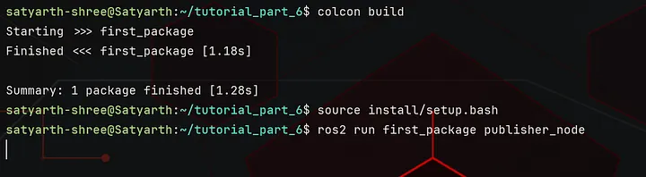
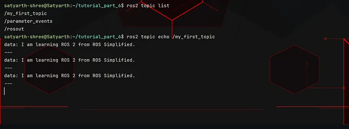

# ROS 2 Tutorial for Beginners (Part 7): Creating a Publisher and Exploring It with ROS 2 CLI

**Satyarth Shree** · 13 min read · Apr 30, 2026

> Complete your publisher node, send messages, and use ROS 2 CLI tools to inspect topics and verify communication step-by-step

## What we've covered so far

In last part we understood what are publishers, subscribers, topics and we also started writing the code for our publisher node.

We have written the code till the point where we have used the super class constructor call statement to call the constructor of our parent class which is the Node class in our case.

I also told you what is a publisher object and what are the arguments that should be passed to it while we are creating it.

Now we will start from this point onwards. For those who haven't read the previous part, I advise you to do so as this part is a direct continuation of that one.

[Click here to read the previous article.](https://medium.com/@satyarthshree45/ros-2-tutorial-for-beginners-part-6-topics-and-publisher-foundations-09b493c64bce)

> By the end of this article, you will be able to run your own publisher node and you will also be able to check whether it is properly running or not using command line tools.

## Writing the Code for our Publisher Node

Inside your constructor just below the super class constructor call write the following line:

```python
self.publisher = self.create_publisher(String, "my_first_topic", 10)
```

Now try to understand what is happening here.

On the right side of "equal to (=)" symbol we have written the following statement:

```python
self.create_publisher(String, "my_first_topic", 10)
```

This statement creates a publisher object using the create_publisher() method.

We have passed three arguments to this method which are — String, "my_first_topic" and 10.

The first argument specifies the type of message which this topic will be publishing, the second argument specifies the name of the topic on which messages will be published and the third argument specifies the QoS setting (queue size) if any delay happens during publishing.

I have already discussed about these three arguments in detail in the previous part. Here we are implementing those three arguments in our actual code.

> Here comes the important part, read carefully!!

If we just create a publisher object using the create_publisher() method, our object gets created but we lose the reference to it.

This is the reason why we created an attribute named publisher and assigned our publisher object to it using the following line:

```python
self.publisher = self.create_publisher(String, "my_first_topic", 10)
```

Now we can use the attribute **publisher** to access our publisher object.

So far we have written this much code:

```python
#!/usr/bin/env python3

import rclpy
from rclpy.node import Node
from example_interfaces.msg import String

class Publisher(Node):
    def __init__(self):
        super().__init__("publisher_1")
        self.publisher = self.create_publisher(String, "my_first_topic", 10)
```

Now we will create a callback. But why so?

The line we have just written has created a publisher object and the reference of that object has been assigned to the publisher attribute but we are not publishing anything yet.

To publish some data we should create a callback which runs every time after a fixed duration so our messages can get published.

We will use the following line to create a callback:

```python
self.timer = self.create_timer(1.0, self.publish_messages)
```

As you can see we have used create_timer() method to create a callback.

You must be thinking what does this line means and what will happen now?

Let me explain.

### create_timer() method

While using the **create_timer()** method we have to pass two arguments.

### First Argument: Time

The first argument is the time after which we want our callback to run. In my case I have passed 1.0, which means that after every one second my callback will run.

The time passed must always be off float data type.

### Second Argument: Method

In second argument we have to assign the method or you can say the function which we want to be called every time after the given amount of the time.

Since in my second argument I have passed: self.publish_messages, which means that after every 1 seconds the method publish_messages() will be called.

You can choose the name of the method according to your preference but make sure it doesn't has any spaces or special characters apart from underscore.

So to summarize I can say that the following line:

```python
self.timer = self.create_timer(1.0, self.publish_messages)
```

calls the method **publish_messages()** after every one second.

In a more technical language, it is better to say that this line passes publish_messages() method as a reference to ROS 2 and asks it to call this method after every 1 second.

I have been using the word "**callback**" in this article a lot. You might be getting confused what a callback is?

Let's explore it first as it is necessary to know especially when you are trying to develop depth on publisher-subscriber systems.

### Callback

Simply put a callback is -

**A function that ROS 2 calls automatically when something happens.**

Here we are using a **Timer callback**. A timer callback is triggered at fixed intervals which depends on the time that you have passed to create_timer() method.

In our case we have passed self.publish_messages as the second argument of the create_timer() method, which means that now this is our callback as it will be triggered (called) in fixed intervals.

Those intervals have been specified in the first argument of create_timer() method. I have set the interval as 1.0 which means after every 1.0 second my callback will be called by ROS 2.

If you have specified the time to be 2.0 seconds then your callback will be called after every two seconds.

There are more type of callbacks like:

1. Subscriber Callback
2. Service Callback
3. Action Callbacks

We will study about them later in this tutorial series. I will also write entire blogs dedicated solely to callbacks as it is one of the fundamental concepts of ROS 2 which most people ignore and then later regret when the are not able to debug issues with their code.

The timer callback line should be written inside our constructor just below the line where we have created our publisher object. So now our code is:

```python
#!/usr/bin/env python3

import rclpy
from rclpy.node import Node
from example_interfaces.msg import String

class Publisher(Node):
    def __init__(self):
        super().__init__("publisher_1")
        self.publisher = self.create_publisher(String, "my_first_topic", 10)
        self.timer = self.create_timer(1.0, self.publish_messages)
```

You might have already noticed the fact we haven't created any method named publish_messages() even though we have passed it as a reference to our timer callback.

You are right!

Our next step is to create the publish_messages and then write the code to publish our messages inside it.

This method will be created inside our class as shown below:

```python
#!/usr/bin/env python3

import rclpy
from rclpy.node import Node
from example_interfaces.msg import String

class Publisher(Node):
    def __init__(self):
        super().__init__("publisher_1")
        self.publisher = self.create_publisher(String, "my_first_topic", 10)
        self.timer = self.create_timer(1.0, self.publish_messages)

    def publish_messages(self):
```

Now before continuing with coding any further you have to understand some things about ROS 2 Build Systems.

## ROS 2 Build Systems

ROS 2 provides us with the power to create our own custom message types. Right now in our code we are using the String message type from example_interfaces package which is a built in package offered by ROS 2.

Whenever we create our own message type then we basically create a file having .msg extension inside a msg folder inside our package.

We will learn how to create our own message types in future after we have studied server and client systems. Here I am basically trying to give you an idea of how the build systems work with message definition files.

After we have defined our message type in the .msg file inside our msg folder, we build our workspace.

While building our workspace, ROS 2 Build Systems or specifically ROS 2 interface generators convert .msg definition file into a python class and fields defined in this file into attributes of our class.

To get an idea of what I am talking about type the following command on your terminal:

```bash
ros2 interface show example_interfaces/msg/String
```

This command will basically display the content written inside String.msg file, which is the definition file for the String message type. You will get the following output:

```
satyarth-shree@Satyarth:~$ ros2 interface show example_interfaces/msg/String
# This is an example message of using a primitive datatype, string.
# If you want to test with this that's fine, but if you are deploying
# it into a system you should create a semantically meaningful message type.
# If you want to embed it in another message, use the primitive data type instead.
string data
```

The lines starting with hashtag symbol (#) are comments. You can ignore them. Focus on the following line:

```
string data
```

This line basically tells that in String() message type we have a field named data which is of string type.

So internally when ROS build systems will build this message definition file, it will create a class named String(), and that class will be having an attribute named data which will accept values of string type only.

So basically inside our python code we have to now treat String as a class.

Now go inside the publish_messages() method and write the following line:

```python
message = String()
```

Now our code is:

```python
#!/usr/bin/env python3

import rclpy
from rclpy.node import Node
from example_interfaces.msg import String

class Publisher(Node):
    def __init__(self):
        super().__init__("publisher_1")
        self.publisher = self.create_publisher(String, "my_first_topic", 10)
        self.timer = self.create_timer(1.0, self.publish_messages)

    def publish_messages(self):
        message = String()
```

"message" is now an object of the String() Class. Now we will use the data attribute of this class to store a value and then we will publish our message on our topic.

To do so inside the publish_messages() method, we will write the following line:

```python
message.data = "I am learning ROS 2 from ROS Simplified."
```

Since the attribute "data" is of string type so we can only pass a string as it's value. You can pass any string of your choice, but you must pass only a string and not some other data type.

We have now specified our message type and the message which we want to publish, but we haven't published it yet.

To publish our message we have to use publish() method of the Publisher class.

To do so we will write the following line:

```python
self.publisher.publish(message)
```

Now our code becomes the following:

```python
#!/usr/bin/env python3

import rclpy
from rclpy.node import Node
from example_interfaces.msg import String

class Publisher(Node):
    def __init__(self):
        super().__init__("publisher_1")
        self.publisher = self.create_publisher(String, "my_first_topic", 10)
        self.timer = self.create_timer(1.0, self.publish_messages)

    def publish_messages(self):
        message = String()
        message.data = "I am learning ROS 2 from ROS Simplified."
        self.publisher.publish(message)
```

After this code at the end we will add the following code:

```python
def main(args = None):
    rclpy.init(args = args)
    node = Publisher()
    rclpy.spin(node)
    rclpy.shutdown()

if __name__ == "__main__":
    main()
```

What does these line means?

> What is rclpy.init()? What is rclpy.shutdown()? Why is rclpy.spin() needed here? …….

You must be having a lot of such questions.

This part has already been covered in [Part 2](https://medium.com/@satyarthshree45/ros-2-tutorial-for-beginners-part-2-creating-your-first-node-c33e92d54b5c) and [Part 4](https://medium.com/@satyarthshree45/ros2-tutorial-for-beginners-part-4-understanding-rclpy-spin-and-creating-a-class-based-node-511c124f55c0) of this tutorial series so you can refer from there if you have any confusion.

So our final code is:

```python
#!/usr/bin/env python3

import rclpy
from rclpy.node import Node
from example_interfaces.msg import String

class Publisher(Node):
    def __init__(self):
        super().__init__("publisher_1")
        self.publisher = self.create_publisher(String, "my_first_topic", 10)
        self.timer = self.create_timer(1.0, self.publish_messages)

    def publish_messages(self):
        message = String()
        message.data = "I am learning ROS 2 from ROS Simplified."
        self.publisher.publish(message)

def main(args = None):
    rclpy.init(args = args)
    node = Publisher()
    rclpy.spin(node)
    rclpy.shutdown()

if __name__ == "__main__":
    main()
```

Now we have to make an executable from this code and then run it.

But before doing so you have to do one small change in your package.xml file.

## Adding dependency in package.xml file

We have used example_interfaces package here which means that now our package inside which we are currently creating our node depends on the example_interfaces package, so we have to add it as a dependency in our package.xml file.

Your package.xml file currently has the following structure:

```xml
<?xml version="1.0"?>
<?xml-model href="http://download.ros.org/schema/package_format3.xsd" schematypens="http://www.w3.org/2001/XMLSchema"?>
<package format="3">
  <name>first_package</name>
  <version>0.0.0</version>
  <description>TODO: Package description</description>
  <maintainer email="satyarth-shree@todo.todo">satyarth-shree</maintainer>
  <license>TODO: License declaration</license>

  <depend>rclpy</depend>

  <test_depend>ament_copyright</test_depend>
  <test_depend>ament_flake8</test_depend>
  <test_depend>ament_pep257</test_depend>
  <test_depend>python3-pytest</test_depend>

  <export>
    <build_type>ament_python</build_type>
  </export>
</package>
```

You can see the following line inside your package.xml file:

```xml
<depend>rclpy</depend>
```

Below this line you have to add the following line:

```xml
<depend>example_interfaces</depend>
```

This line will add **example_interfaces** package as a dependency of the package inside which we are currently working on.

Save all the files including your python file inside which you have created your node, package.xml and setup.py file inside which you have created your executable.

If you don't know how to make an executable and then run the node then you can cover that part from [Part 2](https://medium.com/@satyarthshree45/ros-2-tutorial-for-beginners-part-2-creating-your-first-node-c33e92d54b5c) of this tutorial series. It has already been discussed there.

After doing all this, build and source your workspace and then run your node.

When you run your node you will see nothing is being displayed as shown in the screenshot shared below:

 _Figure 1: Running publisher node_

But why so? Why nothing is being displayed?

This is a very common beginner's confusion.

Nothing is being displayed because our publisher node is actively publishing messages to our topic but it is not actively displaying anything.

## Exploring Topics via ROS 2 CLI

Now we will check whether our publisher node is publishing messages on our topic or not using command line tools.

This section is very important as the commands which I will discuss here will help you debug issues in multi node systems where they are multiple publishers and subscribers.

We will work and create such systems once we learn subscribers which we will do so in upcoming one or two parts.

Now let's start introspecting our topic with CLI tools provided by ROS 2.

### First Command: ros2 node list

Run your publisher node in one terminal and then open another terminal and type the following command in it:

```bash
ros2 node list
```

This command displays the names of those nodes which are currently active/running.

After running this command, I got the following output:

```
satyarth-shree@Satyarth:~$ ros2 node list
/publisher_1
satyarth-shree@Satyarth:~$
```

Which means my node which is named publisher_1 is running.

If you do not get any output then make sure that your publisher node is running on some another terminal and then try this command again.

If your node is running then it will definitely show the name of the node.

The output of this command confirms that our publisher node is running.

Now we should know how to check whether our topic is currently active or not.

### Second Command: ros2 topic list

To check whether our topic is currently active or not type the following command:

```bash
ros2 topic list
```

After running this command you will get the following output:

```
satyarth-shree@Satyarth:~$ ros2 topic list
/my_first_topic
/parameter_events
/rosout
satyarth-shree@Satyarth:~$
```

The name of my topic was: my_first_topic, so this name has been displayed.

If you used some another name for your topic then that name will be displayed.

You might be thinking what are parameter_events and rosout which are being displayed here?

These are some background processes which ROS 2 runs so don't worry about them. They are being run by the ROS 2 system itself, you will see them every time you run **ros2 topic list.**

If you are seeing the name of your topic in the output of this command then it confirms your topic is currently active.

### Third Command: ros2 topic echo

The previous command displayed the name of your topic. You might have noticed that a forward slash has been automatically included in the name of your topic at the very start even if you didn't included it yourself.

This is a very common ROS behaviour.

Now type the following command:

```bash
ros2 topic echo /my_first_topic
```

After echo you have to write the name of your topic. Make sure the name of the topic is the same as it was shown, when you ran the command: ros2 topic list command.

After running this command you will be able to see the messages which are being published by your publisher node on your topic as shown in the image below:

 _Figure 2: Output of the command: ros2 topic echo /my_first_topic_

> There are few very important things which you must take into consideration.

Make sure before running these three commands on a terminal your publisher node is actually running on some another terminal. If you have interrupted your publisher node using Ctrl + C or closed the terminal in which it was running then you won't get any output using these commands.

## Edge Case (rarely happens)

There can be a scenario where your node is properly running but the name of your node and topic is not appearing when you are using the commands I told in previous section.

This happens rarely, but it does.

To fix this issue first type the following command:

```bash
ros2 daemon stop
```

then type the following command:

```bash
ros2 daemon start
```

And now your commands will run if your node is running properly in the background.

You might be thinking what is **ros2 daemon** here?

In simple words, think of it as a background helper which helps keep track of what is happening in your ros2 system so your commands run faster.

It collects information about topics, nodes and services which are currently active and stores it temporarily in the form of **cache** memory. So when you run commands like:

```bash
ros2 node list
ros2 topic list
ros2 service list
```

They often get data from daemon instead of scanning everything again and again.

Sometimes you will notice that these commands are not showing your nodes or topic even if they are running in the background and everything is correctly sourced. This usually happens when daemon cache is outdated.

Stopping and then again starting daemon will reset this cache memory and then every command will run as expected.

## What's Next

This is basically the end of this part. If you have followed all the steps correctly then by now your publisher would definitely be running perfectly on your system.

You basically took your first step in using ROS 2 communication mechanism.

In the next article, I will talk about how you can create a subscriber which subscribes to a topic and displays all the messages which are being published on that topic.

> Till then stay tuned and keep learning!!

**Edit:** Part 8 has been released! Here is the link to read it: [ROS 2 Tutorial for Beginners (Part 8): Create Your First Subscriber Node in Python](https://medium.com/@satyarthshree45/ros-2-tutorial-for-beginners-part-8-create-your-first-subscriber-node-in-python-57a4b2f978f2)

## About the Publication: ROS Simplified

_ROS Simplified_ is a learner-driven publication dedicated to making ROS (Robot Operating System) concepts clear, practical, and accessible. We provide tutorials, conceptual explainers, and project walkthroughs designed to help students, hobbyists, and engineers understand and apply ROS efficiently.

If you want to receive notifications of tutorials like these directly in your inbox then you can subscribe to ROS Simplified by visiting the publication using links given below.

This blog has also been published under the publication — [ROS Simplified](http://rossimplified.substack.com/).

[To view other parts of this ROS 2 Tutorial series click here.](https://rossimplified.substack.com/p/get-started-with-ros-2-a-beginner)

## About the Author

Hi, I am Satyarth Shree, a second-semester BTech Robotics and Automation student at Lovely Professional University (LPU), India. I am an aspiring robotics engineer who is publicly documenting his learning journey using platforms like Medium and Substack.

My areas of interest include ROS, python and mathematics. Currently, I am focusing on ROS more. I have also started a publication named ROS Simplified to make ROS accessible to everyone by providing beginner-friendly tutorials free of cost.

## Let's Connect

- **My Github**: https://github.com/Satyarth-Shree
- **My LinkedIn**: https://www.linkedin.com/in/satyarth-shree-761357374/
- **My CodeWars**: https://www.codewars.com/users/Satyarth-Shree
- **My X**: https://x.com/BuildUnderdog
- **My Hashnode**: https://hashnode.com/@SatyarthShree
- **My Portfolio**: https://satyarthshree.com
- **To professionally contact me for internships, collaborations or similar opportunities click here**: https://forms.gle/SH9bj1oJwqPtJtD26

---

**Tags:** Ros 2, Python, Robotics, Ros2 Tutorial, Ros2 Publisher