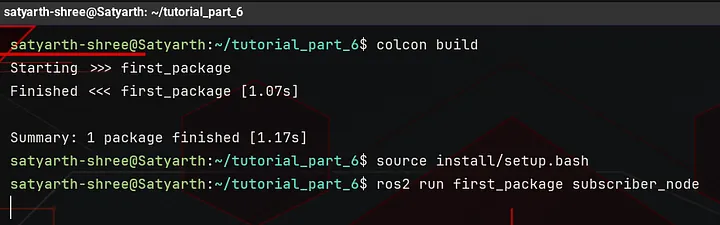
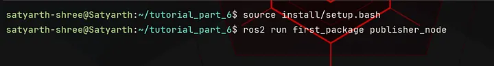
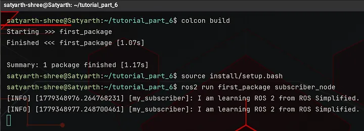
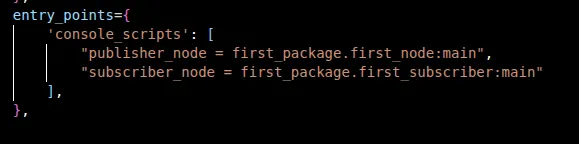

# ROS 2 Tutorial for Beginners (Part 8): Create Your First Subscriber Node in Python

**Satyarth Shree** · 18 min read · May 24, 2026

> Learn how ROS 2 subscribers work by receiving data from topics and handling it using callback functions in Python

## What we've covered so far

In [Part 6](https://medium.com/@satyarthshree45/ros-2-tutorial-for-beginners-part-6-topics-and-publisher-foundations-09b493c64bce), we have conceptually understood what are publishers, subscribers and topics we have also started the hands on coding of a publisher node.

In [Part 7](https://medium.com/@satyarthshree45/ros-2-tutorial-for-beginners-part-7-creating-a-publisher-and-exploring-it-with-ros-2-cli-d98ac9cb4dd0), we completed the hands on coding of our publisher node and introspected it using command line tools. I also explained how message definitions are build by ROS 2 build systems and how resetting ros2 daemon can help debug frustrating issues.

In this part we will learn how to create a subscriber node which displays messages published in a topic on the terminal.

This part is a direct continuation of the previous ones, so make sure you cover part 6 and 7 before jumping to this one. I discussed how to create a node and an executable to run our node, in part 2 of this tutorial series.

In this part we have to create an executable to run our node so make you have read [part 2](https://medium.com/@satyarthshree45/ros-2-tutorial-for-beginners-part-2-creating-your-first-node-c33e92d54b5c) also before continuing with this one.

If you already know how to create a publisher, what publishers, subscribers and topics are conceptually and how to create an executable to run a node then you can directly continue with this one.

> By the end of this article you will be able to create and run your own subscriber node which successfully displays messages published by a publisher node on a topic!

## Writing the Code of a Subscriber Node

First we have to create a python file inside our package so that it can be successfully compiled as a node when we build our workspace.

I am using the same workspace and package which I used in Part 6 and 7. I have created a file named subscriber.py inside my package.

You can choose any other name according to your convenience but make sure that the name doesn't consists of any blank spaces or any special characters apart from underscore (_).

Now inside our python file in which we are going to create our subscriber node, the first line which we will write is the shebang.

I have already told what is shebang in part 2. I will summarize what it is here again.

**Shebang** can simply be understood as a line which tells our Operating System (OS), which interpreter should be used to run our file.

In our case the shebang which we will use is:

```bash
#!/usr/bin/env python3
```

This line tells our operating system that an interpreter named python3 should be used while executing this file.

Shebang must always be placed at the very top of your python file. Rest of the code will always come after it.

After shebang is written we have to import ROS 2 client library for python and then we have to import the Node class present inside the node module of our client library.

> I have already explained the structure of a python library earlier in this series so I won't go in depth here as it will unnecessarily bloat this article with redundant explanations.

But to summarize you can say that a python library is basically a folder of various files. These files are known as modules. One such file inside the rclpy library is node.py and inside this file a class named Node is there.

We have to use the methods and attributes provided by this class to create a node in ROS 2.

So we will write the following lines below the shebang

```python
import rclpy
from rclpy.node import Node
```

As explained in part 6, the job of a subscriber is to receive messages from a topic and then process them accordingly. Any message which has been published on a topic via a publisher always has a message type.

If you want your subscriber to receive those messages then you have to import that message type.

While creating publisher in previous part we used String message type from the example_interfaces package. If we want our subscriber to receive message from this publisher then the message type of our subscriber must be the same as the message type of publisher.

So we will import the String message type from example_interfaces package. After importing the Node class write the following line:

```python
from example_interfaces.msg import String
```

This line imports the message type **String** from example_interfaces package.

Now we will create a sub class of **Node** class and inside the constructor of this class we will use the super class constructor call statement to assign a name to our subscriber node.

To do so we will write the following code after importing the String message type:

```python
class Subscriber(Node):
    def __init__(self):
        super().__init__("my_subscriber")
```

The code which we have written till now is:

```python
#!/usr/bin/env python3

import rclpy
from rclpy.node import Node
from example_interfaces.msg import String

class Subscriber(Node):
    def __init__(self):
        super().__init__("my_subscriber")
```

Now we will start creating our subscriber.

Before creating a subscriber you should first know what is **create_subscription** method and **subscriber callback**.

Let's learn what are these one by one.

## Subscriber callback

Before understanding what a subscriber callback is we must first understand what is a callback in ROS 2.

To put it simply a callback is a method which gets called when something happens.

There are 4 major types of callbacks in ROS 2. They are:

1. Timer callback
2. Subscriber callback
3. Server callback
4. Action Server callback

In previous part, when we created a publisher we used timer callback to publish messages on our topic after every one second.

A timer callback gets called by ROS 2 every time after the specified duration which we have passed as an argument to create_timer() method, but a subscriber callback is different.

> A subscriber callback gets called whenever a message is published on the topic to which our subscriber is associated with, under the condition that the publisher which is publishing the message and our subscriber have the same message type.

If no messages are being published on our topic then subscriber callback method will be not called.

If ten messages are being published every second on our topic then subscriber callback will be called ten times every second.

This is a very important concept. In the upcoming sections of this blog we will create a subscriber callback so that our subscriber node can process messages which are being published on the topic with which it is associated.

## create_subscription Method

This is a method of the Node class which allows us to create subscribers. We have to pass four arguments to it.

### First Argument: Message Type

Every message which is published on a topic by a publisher has a message type. If we want our subscriber to receive these messages then we have to first specify the type of these messages.

In our node we are using the **String** message type which has been imported from the example_interfaces package.

So the first argument of the create_subscription method will be **String**.

### Second Argument: Topic Name

We have specified the type of message which our subscriber node will receive but we haven't specified the topic name yet, so our subscriber doesn't know which topic it has to subscribe.

The name of the topic to which our subscriber will subscribe will be passed as the second argument.

A very important thing to note is that the name of the topic must be passed as a string, which it must be enclosed within double quotes ("").

The name of the topic on which publisher is publishing messages and the name of the topic to which our subscriber is subscribing must be the same.

If they are not same then our subscriber won't receive any message because messages are being published on some another topic.

In previous part, when we created our publisher the name of the topic which we chose was — my_first_topic.

So the second argument of the create_subscription method will be: **"my_first_topic"**.

There should be no spelling mistake while writing the name of the topic because if spelling is changed then our subscriber will subscribe to some other topic instead of the one in which our publisher is publishing messages.

### Third Argument: Subscriber Callback

In the third argument we will pass the name of our subscriber callback. Since we are using class in our node so our subscriber callback will be a method of the class.

We haven't created our subscriber callback yet so let's assume the name of this method is: **subscriber_callback**.

So our third argument will be: **self.subscriber_callback** ("self" has been included in the name because subscriber_callback is a method of the class which we have created).

### Fourth Argument: QoS (Quality of Service) Setting

We have also discussed this while we were creating our publisher node.

Let's suppose your publisher node is publishing messages at rate of 20 messages per second but due to slow processing power or slower DDS networking your subscriber is only able to receive or process 15 messages each second.

So 5 messages are left every second which aren't being received and processed by the subscriber node. This results in a data loss which can be detrimental in real robotic systems where precise data is required.

To solve this issue there is a QoS setting which is passed as the 4th argument of our subscriber node. This QoS setting is basically an integer which specifies the number of extra messages which will be stored to minimize data loss.

Let's again discuss what was happening in our previous example.

Publisher was sending messages at the rate of 20 messages per second but subscriber was able to receive and process those messages only at the rate of 15 messages per second. This means that every second 5 messages remain unprocessed.

Now let's assume you have set QoS Setting to be 15.

This means that now subscriber can hold maximum 15 messages which are left unprocessed. Basically this setting creates a buffer where unprocessed messages are stored so that later when subscriber node is free it can start processing these messages.

After our subscriber node completes the processing of messages which it is currently handling then it will start processing these messages which are stored in this buffer.

This QoS setting is often referred as **QoS history depth**.

Since we have set our QoS history depth to 15 so maximum 15 unprocessed messages can be stored at a time.

If another message is published by the publisher node and this buffer of 15 messages is already full then the oldest message is deleted to make space for this new message.

So we can also conclude that QoS history depth works on a **FIFO (First In First Out)** principle.

According to this principle the message which enters the queue at the starting will also be the first one to get removed to make space for a new message once the queue is full.

We will stop our discussion related to QoS here because the main motive of this article is to create and run our subscriber node.

In future I will publish an article dedicated to different QoS settings as this is a very advanced topic of ROS 2, which is very important for building real robotic systems.

We have learned what is a subscriber callback and create_subscription method so now we will start creating our subscriber.

## Using create_subscription() method

We will write the following line:

```python
self.create_subscription(String, "my_first_topic", self.subscriber_callback, 15)
```

As discussed earlier — the first argument is **String** which is the message type, the second argument is **"my_first_topic"** which is the name of the topic, the third argument is **self.subscriber_callback** which is the name of the subscriber callback which we are going to create and the fourth argument is 15 which is **QoS history depth**.

This line returns a Subscription object which belongs to the subscription class.

But there is a problem here!

We have no variable storing the reference to this object. In python, if an object has no referencing pointing to it then python's garbage collector may destroy it.

So if you write this line then the Subscription object may get garbage collected and subscriber might stop working silently.

You can simply think of python's garbage collector (GC) as a memory management system whose job is:

> Automatically remove objects which are no longer needed to free up memory.

So when you create an object but do not reference it using a variable then Garbage collector assumes that it is a temporary object and discards it sooner or later.

To prevent this to happen we will write the following line instead of the line shared above:

```python
self.subscriber = self.create_subscription(String, "my_first_topic", self.subscriber_callback, 15)
```

Now subscriber will work reliably as long as node is running because now it has a permanent reference to it which is the **subscriber** attribute, so it won't be discarded by Garbage Collector (GC).

The code which we have written till now is:

```python
#!/usr/bin/env python3

import rclpy
from rclpy.node import Node
from example_interfaces.msg import String

class Subscriber(Node):
    def __init__(self):
        super().__init__("my_subscriber")
        self.subscriber = self.create_subscription(String, "my_first_topic", self.subscriber_callback, 15)
```

We have used create_subscription() method to create a subscriber. Now it is time to create a subscriber callback which runs every time a message is published on the topic associated with the subscriber.

## Creating Subscriber Callback

Now we will create another method named **subscriber_callback** inside our class, because we have passed this method as the third argument of **create_subscription()** method which means that now this is our subscriber callback.

I earlier told that subscriber callback gets called whenever a message is published on the topic with which our subscriber is associated with, under the condition that this message has the same message type as that of our subscriber.

This is correct but there is one more thing which you should know!

Whenever our subscriber callback is called then two arguments get internally passed to it.

The first argument is the object instance because our subscriber callback is a method of a class. This object instance is represented using the word — **self**.

The second argument is the message which has triggered ROS 2 communication mechanism to call our subscriber callback.

As I earlier stated, that subscriber callback gets called only when a message of relevant message type is published on the correct topic.

The converse is also true!

If subscriber callback is getting called then a relevant message must have been published to the topic with which this subscriber node was associated with!

This message is passed as the second argument of **subscriber_callback**.

Now to create subscriber_callback we will write the following line:

```python
def subscriber_callback(self, msg: String):
```

Since subscriber_callback is a method of the class so it must be written inside our class.

As you can see that the first argument which we have specified while defining this method is **self** and the second argument is:

> msg: String

This argument specifies that the message which is been passed internally to the **subscriber_callback()** method is of String type.

Try to recall what I explained about message types in previous part.

I told that whenever we create a message type then ROS 2 build systems convert that message type into a class and the fields which we defined inside that message type into attributes of that class.

So the **String** message type, which we are using can be treated as a class and this class has an attribute named **data** which stores the message that has been published by our subscriber node.

We want to display this message so we will write the following line inside subscriber_callback() method:

```python
self.get_logger().info(msg.data)
```

Here **msg** can be considered as an object of the **String** class.

The code we have written till now is:

```python
#!/usr/bin/env python3

import rclpy
from rclpy.node import Node
from example_interfaces.msg import String

class Subscriber(Node):
    def __init__(self):
        super().__init__("my_subscriber")
        self.subscriber = self.create_subscription(String, "my_first_topic", self.subscriber_callback, 15)

    def subscriber_callback(self, msg: String):
        self.get_logger().info(msg.data)
```

Now we will create the main() function which will become the entry point of executable which we will create to start this node.

I have already discussed about this function in part 2 of this tutorial series so I will just write the code here.

Now after adding the main() function our full code becomes:

```python
#!/usr/bin/env python3

import rclpy
from rclpy.node import Node
from example_interfaces.msg import String

class Subscriber(Node):
    def __init__(self):
        super().__init__("my_subscriber")
        self.subscriber = self.create_subscription(String, "my_first_topic", self.subscriber_callback, 15)

    def subscriber_callback(self, msg: String):
        self.get_logger().info(msg.data)

def main(args = None):
    rclpy.init(args = args)
    node = Subscriber()
    rclpy.spin(node)
    rclpy.shutdown()

if __name__ == "__main__":
    main()
```

Now we will create an executable in setup.py file and then we will run this node.

After saving all the files, build and source your workspace. The name which I have selected for my executable is — **subscriber_node**.

So now after building and sourcing my workspace I will run my node as shown in the figure below:

 <br>_Image 1: Output after running the subscriber node_

As you can see nothing is displayed!

But why?

Because even though our subscriber node is running but our publisher isn't, so no messages are being published on our topic which is why subscriber isn't displaying anything.

Now open a new terminal and then source your workspace in that new terminal and then run your publisher node.

Once you do that you will start seeing messages in the terminal in which subscriber node is running as shown in the images given below:

 <br>_Image 2: Sourcing workspace in another terminal and then running publisher._

 <br> _Image 3: Subscriber started displaying messages after publisher starts running._

While creating our publisher node we passed **1.0** as the first argument of create_timer() method. Because of this decision every second one message is being published by the publisher node on our topic.

So every second one message is being displayed by our subscriber node.

> If your subscriber is displaying messages which are being published by the publisher node then congratulations, you have created and successfully ran you first subscriber node!!

But it is also entirely possible that your subscriber is not running or it is not displaying messages which are being published by the publisher node.

Since you are reading this part, so I assume that your publisher node is working perfectly and the problem is with your subscriber node because we have already created and ran our publisher node successfully in previous part.

Now let's troubleshoot step by step so that you can fix your problems in your subscriber node!

## Mistakes

In this section, I will list down the various possible mistakes which you have likely done because of which your subscriber node is not running or it is running but it can't receive messages published by the publisher node.

### Mistake 1: Wrong Syntax in Code

While trying to run your subscriber node if you are seeing a large wall of text then this likely means that you have made some syntax errors in your code.

I will share the full code snippet once more. Make sure each and every line of your code matches the code which I am going to share below.

```python
#!/usr/bin/env python3

import rclpy
from rclpy.node import Node
from example_interfaces.msg import String

class Subscriber(Node):
    def __init__(self):
        super().__init__("my_subscriber")
        self.subscriber = self.create_subscription(String, "my_first_topic", self.subscriber_callback, 15)

    def subscriber_callback(self, msg: String):
        self.get_logger().info(msg.data)

def main(args = None):
    rclpy.init(args = args)
    node = Subscriber()
    rclpy.spin(node)
    rclpy.shutdown()

if __name__ == "__main__":
    main()
```

Make sure everything is like this in your code and there are no syntax mistakes.

This is the first step in debugging a ROS 2 node issue.

> First confirm that your code is fully correct and has zero syntax issues!

### Mistake 2: setup.py file is not properly configured

Open your setup.py file and make sure that the console scripts must be somewhat like this:

 <br>_Image 4: Console scripts section of setup.py file_

I have created two executables — one for publisher node and one for subscriber node.

Your console scripts section should also has the same structure. Two executables must be created so that two entry points, one for your publisher node and one for your subscriber node can be created.

Make sure that syntax of this console scripts section is also correct.

A common beginner mistake is that many people forget the comma (,) after writing the first executable. This is a something which I myself have done a lot of times. So make sure there are no such mistakes in this section.

If you do not know how to create an executable then I would recommend you to read [part 2](https://medium.com/@satyarthshree45/ros-2-tutorial-for-beginners-part-2-creating-your-first-node-c33e92d54b5c) of this tutorial series first as this topic has already been covered there.

### Mistake 3: example_interfaces must be added as a dependency

Another mistake is that you have forgotten to add example_interfaces as a dependency of your package.

To do so open package.xml file of your package.

You will see the following line in your package:

```xml
<depend>rclpy</depend>
```

Below this line write the following line:

```xml
<depend>example_interfaces</depend>
```

Sometimes not adding the package you are using inside your node as a dependency results in errors as well!

### Mistake 4: Not building and sourcing your workspace properly

Sometimes you have written each and every line of code perfectly but because of some minor mistakes your node is not running.

One such mistake is not building and sourcing your workspace properly.

> Make sure before building your workspace you have saved all your files in which you made changes including your python file in which you have created subscriber node, python file in which you have created publisher node, setup.py file and package.xml file.

This is very important!

If you are building your workspace without saving your files then your changes won't be build properly.

So the first step is to make sure all you files are saved.

The second step is to build your workspace.

Now comes the important part!

You have to basically run two different nodes — one is your publisher node and one is your subscriber node simultaneously.

To do so you need two terminals and your workspace must be sourced in both of them properly.

So make sure when you open those two terminals you should first source the workspace and then you should run your nodes.

### Mistake 5: Using wrong naming convention for node and topic names

If you violate ROS 2 naming convention or you can say naming rules for node and topic names then you will run into an error while trying to run your node.

So make sure your node and topic name follow the naming convention stated below.

> Naming convention for ROS 2 nodes states that name of a ROS 2 node can contain alphabets from a to z, numbers from 0 to 9 and only one special character which is underscore (_). A ROS 2 node name can contain numbers but it cannot start with a number.

For Topics:

> Naming convention for ROS 2 topics states that the name of a ROS 2 topic can contain alphabets from a to z, numbers from 0 to 9 and only two special characters which are underscore (_) and forward slash (/). A ROS 2 topic name can contain numbers but it cannot start with a number and a number must not immediately come after a forward slash (/).

Always remember these two naming rules because while working with real systems you will frequently deal with nodes and topics.

Make sure that the name which you have chosen for your topic and node should follow these two naming rules otherwise ROS 2 will throw an error when you will try to run your node.

### Mistake 6: Topic name mismatch

If both your publisher and subscriber nodes are running perfectly without any errors but your subscriber is not displaying the messages published by the publisher then you are certainly facing this issue.

It is possible that you have provided different topic names for your publisher node and for your subscriber node because of a minor spelling mistake or may be deliberately.

Make sure that the topic name which you have provided to your subscriber as well as to your publisher must be exactly the same. There should be no spelling mistakes. Each and every character and it's position in the topic name must be 100% same in both the publisher and subscriber.

If it is not same, then your publisher is publishing messages to a different topic while your subscriber has subscribed to a different topic on which no message name is getting published.

This is the reason why both your publisher and subscriber nodes are running perfectly but your subscriber is not displaying messages published by the publisher.

> Are you interested in reading such articles? If yes, then you are welcomed to join a community which is trusted by 220+ people for ROS 2 Tutorials. [Click here](https://rossimplified.substack.com/).

## Conclusion

If you have followed all the steps which I have mentioned above then your subscriber node must be running perfectly by now.

In the next article of this ROS 2 Tutorial series, we will deeply explore ROS 2 command line tools for topics and how you can use them.

> Till then stay tuned and keep learning!!

## About the Publication — ROS Simplified

_ROS Simplified_ is a learner-driven publication dedicated to making ROS (Robot Operating System) concepts clear, practical, and accessible. We provide tutorials, conceptual explainers, and project walkthroughs designed to help students, hobbyists, and engineers understand and apply ROS efficiently.

If you want to receive notifications of tutorials like these directly in your inbox then you can subscribe to ROS Simplified by visiting the publication using links given below.

This blog has also been published under the publication — [ROS Simplified](http://rossimplified.substack.com/).

[To view other parts of this ROS 2 Tutorial series click here.](https://rossimplified.substack.com/p/get-started-with-ros-2-a-beginner)

## About the Author

Hi, I am Satyarth Shree, a second-semester BTech Robotics and Automation student at Lovely Professional University (LPU), India. I am an aspiring robotics engineer who is publicly documenting his learning journey using platforms like Medium and Substack.

My areas of interest include ROS, python and mathematics. Currently, I am focusing on ROS more. I have also started a publication named ROS Simplified to make ROS accessible to everyone by providing beginner-friendly tutorials free of cost.

## Let's Connect

- **My Github**: https://github.com/Satyarth-Shree
- **My LinkedIn**: https://www.linkedin.com/in/satyarth-shree-761357374/
- **My CodeWars**: https://www.codewars.com/users/Satyarth-Shree
- **My X**: https://x.com/BuildUnderdog
- **My Hashnode**: https://hashnode.com/@SatyarthShree
- **My Portfolio**: https://satyarthshree.com
- **To professionally contact me for internships, collaborations or similar opportunities click here**: https://forms.gle/SH9bj1oJwqPtJtD26

---

**Tags:** Ros 2, Python, Robotics, Ros2 Tutorial, Subscriber Node