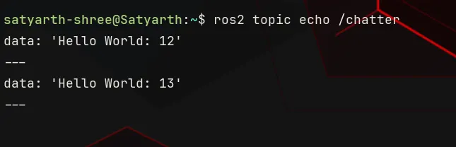
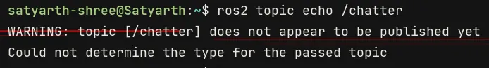
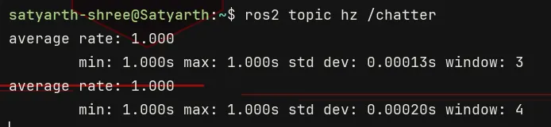
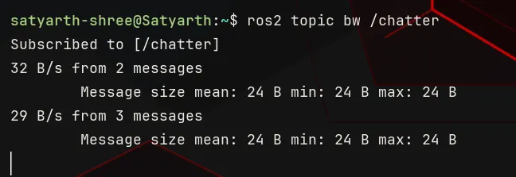

# ROS 2 Tutorial for Beginners (Part 9): Exploring Topics with ROS 2 Command Line Tools

**Satyarth Shree** · 19 min read

> Learn how to inspect, monitor, and analyze ROS 2 topics using practical command-line tools and real publisher-subscriber examples.

In previous part, we have successfully created and ran our first subscriber node while in [part 7](https://medium.com/@satyarthshree45/ros-2-tutorial-for-beginners-part-7-creating-a-publisher-and-exploring-it-with-ros-2-cli-d98ac9cb4dd0) we created and ran our publisher node.

So basically we have learned ROS 2 to a point where we can now create publisher and subscriber systems, b[[part-10-sub-part-1-building-a-number-processor]]ut knowing only how to create them is not the end!

Sometimes you will try to establish communication between two nodes by making one of them a publisher and the other one a subscriber, but the desired communication won't happen. Many unwanted or you can say unexpected errors might happen.

Because of this reason we must have the ability to debug our topic and the publisher — subscriber system which we have created.

This part is especially focused on various command line tools offered by ROS 2 which can help us debug, modify, inspect and test our systems. We will learn all these tools one by one.

Knowing them completely will provide you with an ability to calmly navigate through any issue which you will face while building systems involving publisher, subscriber and topics.

> By the end of this article, you will be able to use various CLI tools provided by ROS 2 to inspect topics and nodes related to it.

## Running a Built-In Publisher and Subscriber

To learn different commands which will be taught in this article, you have to first run a publisher and a subscriber.

ROS 2 provides a built in publisher and subscriber node named talker and listener respectively. You can run your own publisher and subscriber system but I would recommend running this one so that we are all on the same page.

To start the built-in publisher run the following command:

```bash
ros2 run demo_nodes_cpp talker
```

Now to run the subscriber node open another terminal and run the following command:

```bash
ros2 run demo_nodes_cpp listener
```

Now your publisher — subscriber system is running. We will test all the commands which we sill study on this system.

Open a third terminal to run various commands which we are now going to learn.

## First Command: ros2 node list

This command is used to check which nodes are currently running. When you will run it, you will see the following output:

```
/listener
/talker
```

These two are the built-in nodes which we just ran in the previous section of this article. If you have ran some other nodes then you will see their names instead of these ones.

## Second Command: ros2 topic list

This command is used to check which topics are currently active. When you run it, you will see the following output:

```
/chatter
/parameter_events
/rosout
```

**parameter_events** and **rosout** are topics which are always running in background.

rosout is used for logging while parameter_events is used for parameter updates. **Logging** and **parameter updates** are some properties which ROS 2 automatically associates with a node. So whenever you run a node, these two topics are almost always running in the background.

This definition is not 100% technically accurate. It is an easy way to understand why these two topics are always active.

If you want a technically strict explanation, then the absolute correct way to explain this phenomenon is:

Every ROS 2 node is provided with built-in logging and parameter-management capabilities. These capabilities use the /rosout and /parameter_events topics respectively, which is why these topics are commonly present whenever ROS 2 nodes are running.

The topic **chatter** is running because the publisher and subscriber nodes which we have started communicate via this topic.

> So to conclude, this command provides us with the names of topics which are currently active.

## Third Command (Edge case): Related to ros2 daemon

In this section we will basically study three commands. These are related to ros2 daemon.

First we will understand what is daemon, why is it important and then commands related to it.

Whenever we use commands like ros2 node list or ros2 topic list then ROS 2 fetches information about the nodes or topics which are currently running from ROS 2 daemon.

ROS 2 daemon can be understood as a background process which caches information like currently active nodes and topics so that command line tools can respond quickly.

By caching information, I mean temporarily storing information.

ROS 2 daemon continuously monitors ROS 2 graph and updates itself whenever new nodes, topics or services appear or disappear.

But sometimes due to some technical glitch, ROS 2 daemon becomes stale and stops updating itself. Because of this issue you might not see the name of your node or topic when using CLI tools even if it is running in the background.

This is a very rare issue, but it occurs.

To fix it we have to restart ROS 2 daemon.

First we have to stop ROS 2 daemon. To do so type the following command:

```bash
ros2 daemon stop
```

Now we will start daemon again. To do so type the following command:

```bash
ros2 daemon start
```

Now your daemon is restarted, so the issue of daemon going stale won't occur.

To check whether your daemon is running or not you can type the following command:

```bash
ros2 daemon status
```

If daemon is running, then you will see the following output:

```
The daemon is running
```

And if it is not, then you will see the following output:

```
The daemon is not running
```

Make sure that the daemon is running! Use the start command, if it is not.

## Fourth Command: ros2 topic echo /topic_name

Let's suppose you have made your publisher node but you haven't made your subscriber node and you want to check whether your publisher is publishing messages or not.

Then this is the best command at your disposal. This command displays the messages which are being on published on your topic. The syntax of this command is:

```bash
ros2 topic echo /topic_name
```

Replace **topic_name** by the name of your topic.

We are currently running a publisher named talker. This publisher publishes messages to a topic named **chatter**. So to check which messages are being published on this topic, type the following command:

```bash
ros2 topic echo /chatter
```

You will start seeing output as shown in the figure below.

 <br> _Figure 1: Output of the command — ros2 topic echo /chatter_

If your publisher is not running and no topic named chatter is active then you will get a warning as shown in the figure below.

 <br> _Figure 2: Warning message being displayed if we try to echo a topic which is not active._

> So to summarize, we can say that this is a useful command as it allows us to check which messages are being published on a topic without running a subscriber node.

## Fifth Command: ros2 topic hz /topic_name

Hz is the SI unit to measure frequency. This command is used to measure the frequency at which messages are being published on a topic. By frequency, I mean number of messages being published every second.

The syntax of this command is:

```bash
ros2 topic hz /topic_name
```

Replace **topic_name** by the name of your topic. Since currently chatter topic is active so we will run the following command:

```bash
ros2 topic hz /chatter
```

You will get output as shown in the figure below.

 <br> _Figure 3: Output of the command — ros2 topic hz /chatter_

As you can see the output displays five different parameters at once. They are —

1. average rate
2. min
3. max
4. std dev
5. window

**Min** is the minimum duration which has been observed between two consequent messages. **Max** is the maximum duration which has been observed between two consequent messages.

**Average rate** is the average publishing frequency in Hz (messages per second). **std dev** stands for standard deviation.

Here standard deviation measures how consistent the message publishing rate is. If the standard deviation is less then this means that messages are being published at regular intervals but if it is more then it means that timings between messages vary more.

**window** means number of intervals which were analyzed to estimate the frequency. Intervals means the duration between two consequent messages.

> To summarize, we can say that this command is useful because it allows us to check at which rate messages are being published on our topic.

## Sixth Command: ros2 topic bw /topic_name

This command shows us the amount of data being published on the topic every second. The syntax of this command is —

```bash
ros2 topic bw /topic_name
```

Replace **topic_name** by name of your topic. In this command bw means **Bandwidth**.

In our case we are analyzing the topic chatter, so we will run the following command:

```bash
ros2 topic bw /chatter
```

You will see the output in a format which is shown in the figure given below.

 <br> _Figure 4: Output of the command — ros2 topic bw /chatter_

You can see messages like:

```
32 B/s from 2 messages
29 B/s from 3 messages
```

32 B/s from 2 messages means that approximately 32 Byte of data was published in a single second and this data was estimated by analyzing 2 messages.

The second message states that after analyzing 3 messages it has been estimated that per second, 29 Byte of data is being published on this topic in every second.

We can also see parameters like Message size mean, min and max in the output.

Message mean size displays the average size of the message while max and min displays the maximum and minimum size of messages respectively which are being published on the topic.

In our case, publisher is publishing only a single message every time so the values of these three parameters are same.

> To summarize, we can say that this command is useful because it allows us to check how much data is being published on our topic every second.

## Seventh Command: ros2 topic info /topic_name

This topic allows us to inspect information about a specific topic. The syntax of this command is —

```bash
ros2 topic info /topic_name
```

Replace **topic_name** by the name of your topic.

In our case, we are dealing with the chatter topic currently, so we will run the following command:

```bash
ros2 topic info /chatter
```

You can also use this command for any other topic which is currently active. Just make sure that you are following the correct syntax. After running this command you will see the following output:

```
Type: std_msgs/msg/String
Publisher count: 1
Subscription count: 1
```

Three different types of information are displayed whenever we run this command for any topic. They are Type, Publisher count and Subscription count.

Publisher count is the number of publishers which are currently publishing on the topic. Subscription count is the number of subscribers which have subscribed to this topic.

Every message which is published to a topic has a message type. The Type parameter shows the message type and the package from where that message type belongs.

For example, in the output which we have got, the Type is:

```
std_msgs/msg/String
```

This means that messages of the message type **String** are been published on this topic and the message definition file of this message type (which is String.msg) is stored in the **std_msgs** package.

> To summarize, we can say that this command is useful because it allows us to check the type, publisher count and subscription count of our topic.

## Eighth Command: ros2 interface show message_type

This command allows us to check what are the fields of a message or service type.

For example, in previous section we learned that the type of the topic chatter is **std_msgs/msg/String**. But we do not know what this message type accepts as input and what is the type of that input.

Basically what I am trying to say that we don't know the message definition of this String message type. This command basically shows us the message definition file of any message or service type. The message type contains information like the fields of that message type (in which you enter data which is published) and the type of those fields.

The syntax of this command is:

```bash
ros2 interface show message_type
```

Replace **message_type** by the actual message type.

In this case, the actual message type is written in a specific way. First we have to write the package name, then a forward slash, then the folder name inside which we write our message definitions which is the **msg** folder, then we again put a forward slash and then we write the message type.

For example, the type of chatter topic which is: std_msgs/msg/String.

Since we are dealing with this message type so we will write the following command:

```bash
ros2 interface show std_msgs/msg/String
```

We will get the following output:

```
# This was originally provided as an example message.
# It is deprecated as of Foxy
# It is recommended to create your own semantically meaningful message.
# However if you would like to continue using this please use the equivalent in example_msgs.

string data
```

The lines starting with the hashtag symbol (#) are comments. You can safely ignore them as they do not get processed by ROS 2 build systems during compilation.

Focus on the following line:

```
string data
```

This line means that this message type has one field, which is data and type of that field is string. Whenever we will use this message we have to assign the value which we want to publish to this field (data) and the type of that value must be string.

This is how you can check the field and data type that a message type allows.

> To summarize, we can say that this command is extremely useful as it allows us to inspect the message definition of a message type.

## Ninth Command: ros2 topic pub -r rate_hz topic_name message_type "message_data"

This command allows us to publish data at a topic without the need of creating any publisher node.

The syntax of this command is:

```bash
ros2 topic pub -r rate_hz topic_name message_type "message_data"
```

Replace **rate_hz** by an integer or a float number. This represents the rate at which messages will be published to the topic. Replace **topic_name** by the name of the topic in which you want to publish your message.

Replace **message type** by the actual message type of your topic. If you do not know the message type then just use the 7th command of this article to find it out. Copy paste the exact message type obtained after using the 7th command.

Now inside the double quotes you have to write the message which you want to publish. There is a specific syntax that you have to follow while specifying the message.

> Carefully read the example explained below to understand this syntax.

Currently we are running talker and listener which are publisher and subscriber nodes respectively from demo_nodes_cpp package. Click on the terminal in which you are running your talker node and press Ctrl + C to terminate it.

To use this command, we will first kill the publisher which is already publishing messages to the topic **chatter** so that we can fully focus on observing the messages published because of this command.

After terminating talker node, you will notice that listener node has stopped displaying any messages because now no publisher node is actively publishing on the topic chatter.

Let's suppose I want to publish two messages every second on this topic, but I have forgotten what is the message type. So first I will run the following command:

```bash
ros2 topic info /chatter
```

This command will give the following output:

```
Type: std_msgs/msg/String
Publisher count: 0
Subscription count: 1
```

Now we know the type of message being published on this topic.

An interesting thing to note here is that publisher count is zero. This is because we terminated the talker node. When I explained this command earlier, both the publisher and subscription counts were one because both the nodes — talker and listener were running.

Now we have decided the rate with which data will be published (2 Hz), the topic on which messages are to be published (chatter) and the message type of this topic.

According to the syntax of the command we need to know one more thing, and that thing is the message data.

Read very carefully from now onwards! I am going to explain the syntax of message data.

As told in previous section, the **interface** command can be used to inspect our message type. When we check the message type, we can see which field is present and what is its data type.

In previous section, when we checked the message type of topic chatter using the interface command, we got to know that it has a field named data which is of string data type.

Now let's suppose I want to publish the following string:

> "I am learning ROS 2 from ROS Simplified."

Then I will write message data in the following manner:

> "{data: 'I am learning ROS 2 from ROS Simplified.'}"

This is how message data needs to be written. Syntactically we can write it as:

> "{field_name: value}"

The first thing we have to do is either enclose the curly brackets in double or single inverted commas.

The message type of our topic has data as a field and it's type is string. Which is why we replaced field name by data and value by the value of our field which is: 'I am learning ROS 2 from ROS Simplified'.

Since we have used double inverted commas to enclose the curly brackets so we will use single inverted commas inside to write our string. The converse is also true. If we have used single inverted commas outside to enclose curly brackets then we will use double inverted commas inside to write string.

Now the full command becomes:

```bash
ros2 topic pub -r 2 /chatter std_msgs/msg/String "{data: 'I am learning ROS 2 from ROS Simplified.'}"
```

As soon as you type this command and press enter you will start seeing that the subscriber node (which is listener in this case), has started displaying the message which we have published via this command.

So basically this is a command which allows us to publish messages on our topic without the need of any publisher node.

The utility of this command in day to day ROS 2 usage is that it can allow you to check whether your subscriber node is working correctly without creating a publisher node.

Think of it as the counter part of the **ros2 topic echo** command. The echo command allows us to check whether our publisher node is working correctly without creating a subscriber node meanwhile this command allows us to check whether our subscriber node is working correctly without creating a publisher node.

This is actually a very important insight!

It tells us a lot about the design philosophy of ROS 2. It is not just a middleware used to create high end robots.

It is an entire system which provides all the tools required in every step of building a complex robot including simulators (Gazebo), GUI tools like rqt graph to inspect an entire system visually and CLI tools like the ones we discussed in this article because real robots do not have monitors so you need text based tools.

This also tells us a lot about how competent engineering minds like the creators of ROS 2 think. They do not just think about a huge sized flashy robotics arm. They broke it down into it's atomic components and realized the fact that these simple looking CLI tools will help us quickly test whether different sub parts of our system are working well or not.

Let's suppose you are making an AGV (Autonomous Grounded Vehicle) which stops when the ultrasonic sensor mounted on it detects that there is an obstacle at a distance less than 5 cm from the robot.

You have created a subscriber node which takes data from ultrasonic sensor and when the distance reading falls below 5 cm, it sends data to motors to stop spinning. Let's assume you have made a mistake!

You have accidentally broken your ultrasonic sensor or it is currently not available for some other reason. How will you get to know whether your subscriber node which is responsible for stopping your car is working correctly or not?

This is exactly where our ninth command, the one which we just studied comes into picture!

We can use this command to publish fake sensor data to the topic which is associated with our subscriber node and in this way we can actually test whether our node is working properly or not and whether the car is stopping as expected.

These all edge cases were considered while creating ROS 2 which is most probably the reason why we have been provided with so many CLI tools. They all have practical utility in real systems!

Imagine having the foresight to predict the real world messiness to such an accurate degree and then to build tools to increase real world reliability. The minds of these people who created ROS 2 genuinely surprises me!

In my opinion, ROS 2 is an engineering marvel!

Alright let's come back to the topic of the article. I shall write a separate blog to share my opinion on the design philosophy of ROS 2 from what I have grasped.

## Tenth Command: pub command with once flag

The syntax of this command is:

```bash
ros2 topic pub --once topic_name message_type "{message_data}"
```

Notice that this command is similar to the previous one. We just replaced **-r rate_hz** by:

```
--once
```

Terms like **r** and **once** are known as flags. This is an important technical term which you should remember. The **r** flag is also known as **rate flag** because it helps us in specifying the rate at which messages should be published on the topic.

In the previous command, we used the **r** flag to specify the frequency at which messages should be published but in this command we have used the **once** tag.

> Because of the once flag, the message will be published only once on the topic. We can use this command if we want only a single message to be published.

Only the flag changes, rest all the things are same as the previous command.

Type the following command:

```bash
ros2 topic pub --once /chatter std_msgs/msg/String "{data: 'I am learning ROS 2 from ROS Simplified.'}"
```

And you will notice that your subscriber node (listener, in our case) will display only one message.

## Eleventh Command: ros2 node info /node_name

This command can be considered as the counterpart of seventh command (ros2 topic info /topic_name) for ROS 2 nodes.

The seventh command which we studied allows us to find information about a topic meanwhile this command allows us to find details about a node.

Currently our subscriber node, which is named listener is running. Let's suppose I want to find details about this node then I will write the following command:

```bash
ros2 node info /listener
```

As you can see while using this command we have to replace **node_name** by the actual name of our node.

You will get the following output after running this command:

```
/listener
  Subscribers:
    /chatter: std_msgs/msg/String
    /parameter_events: rcl_interfaces/msg/ParameterEvent
  Publishers:
    /parameter_events: rcl_interfaces/msg/ParameterEvent
    /rosout: rcl_interfaces/msg/Log
  Service Servers:
    /listener/describe_parameters: rcl_interfaces/srv/DescribeParameters
    /listener/get_parameter_types: rcl_interfaces/srv/GetParameterTypes
    /listener/get_parameters: rcl_interfaces/srv/GetParameters
    /listener/get_type_description: type_description_interfaces/srv/GetTypeDescription
    /listener/list_parameters: rcl_interfaces/srv/ListParameters
    /listener/set_parameters: rcl_interfaces/srv/SetParameters
    /listener/set_parameters_atomically: rcl_interfaces/srv/SetParametersAtomically
  Service Clients:

  Action Servers:

  Action Clients:
```

You can see terms like action, servers, client, parameters, rcl_interfaces etc.

As we will progress further in this series, we will learn about each of these terms and then you will be able to understand what this information is telling us. For now you can just remember the utility of this command.

## Conclusion

These are the most useful commands which you will need to create publisher and subscriber systems. There are many other commands in ROS 2, which we will gradually learn as we progress further in this series but for our current level this is all we need.

Do not try to memorize all these commands. Just start practicing ROS 2. You will automatically learn all of these when you will be working on nodes or different projects.

I would recommend you to bookmark or save the link of this article for reference so that you can quickly look for commands in it whenever you are stuck.

## What's Next

Knowing commands is not the same as learning it! You can only claim that you have learned a command once you are comfortable with practically implementing it.

Now before proceeding on to next topic of ROS 2, we will do two mini exercises.

Details of the first mini exercise are given below:

1. Create a publisher node which publishes random integers from 0 to 10 on a topic.
2. Create a subscriber node which divides the number published on the topic by 2 and displays it.

Hints for this mini exercise:

1. Use Int64 message type from example_interfaces package (message type is example_interfaces/msg/Int64).
2. Use ros2 interface show command to get details about this message type.
3. Use random module provided by python for generating the random integers. You can learn how to use random module from AI, if you don't know about it. It is an easy module so you only need a maximum of 10 minutes of time to learn how to use it for this exercise.
4. Instead of creating the entire system in one go first create the publisher node and then verify whether it is working using the echo command. If it is working, then you can create the subscriber node.
5. Second approach is, to first create the subscriber node and then verify whether it is working or not using the pub command. If it is working, then you can create your publisher node.
6. All the commands which you will need to debug or complete this mini exercise have already been explained in this blog. Use it as a reference.

The concepts required to complete this exercise have been covered in a step by step manner from part 6 to part 9 of this tutorial series. If you have read all of them religiously and did hands on coding with me (as I always tell to do), then you will be able to complete this exercise.

Details of the second mini exercise will be revealed once we have completed and discussed the first one.

In the next part which is part 10 of this tutorial blog series, I will do the hands on coding of this mini exercise. If you face any problems then you can refer to that part.

If you were able to complete this mini exercise then you may skip the next part, but I would recommend you to read it if you want insights on how to use the commands which we discussed in this article practically.

> Till then stay tuned and keep learning!!

## About The Publication — ROS Simplified

_ROS Simplified_ is a learner-driven publication dedicated to making ROS (Robot Operating System) concepts clear, practical, and accessible. We provide tutorials, conceptual explainers, and project walkthroughs designed to help students, hobbyists, and engineers understand and apply ROS efficiently.

If you want to receive notifications of tutorials like these directly in your inbox then you can subscribe to ROS Simplified by visiting the publication using links given below.

This blog has also been published under the publication — [ROS Simplified](http://rossimplified.substack.com/).

[To view other parts of this ROS 2 Tutorial series click here.](https://rossimplified.substack.com/p/get-started-with-ros-2-a-beginner)

## About the Author

Hi, I am Satyarth Shree, a first year BTech Robotics and Automation student at Lovely Professional University (LPU), India. I am an aspiring robotics engineer who is publicly documenting his learning journey using platforms like Medium and Substack.

My areas of interest include ROS, python and mathematics. Currently, I am focusing on ROS more. I have also started a publication named ROS Simplified to make ROS accessible to everyone by providing beginner-friendly tutorials free of cost.

## Let's Connect

- **My Github**: https://github.com/Satyarth-Shree
- **My LinkedIn**: https://www.linkedin.com/in/satyarth-shree-761357374/
- **My CodeWars**: https://www.codewars.com/users/Satyarth-Shree
- **My X**: https://x.com/BuildUnderdog
- **My Hashnode**: https://hashnode.com/@SatyarthShree
- **My Portfolio**: https://satyarthshree.com
- **To professionally contact me for internships, collaborations or similar opportunities click here**: https://forms.gle/SH9bj1oJwqPtJtD26

---

**Tags:** Ros2, Robotics, Ros2 Tutorials, Command Line Tools, Publisher Subscriber